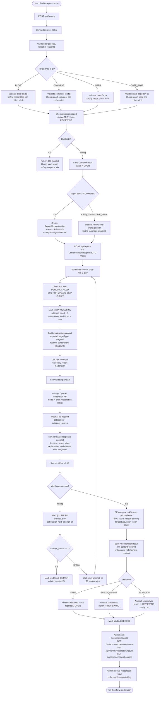

# Report Moderation V2 Activity Flow

```mermaid
flowchart TD
    Start(["User bắt đầu report content"])

    Start --> A["POST /api/reports"]
    A --> B["BE validate user active"]
    B --> C["Validate targetType, targetId, reasonId"]
    C --> D{"Target type là gì?"}

    D -->|"BLOG"| E["Validate blog tồn tại<br/>không report blog của chính mình"]
    D -->|"COMMENT"| F["Validate comment tồn tại<br/>không report comment của chính mình"]
    D -->|"USER"| G["Validate user tồn tại<br/>không report chính mình"]
    D -->|"CAFE_PAGE"| H["Validate cafe page tồn tại<br/>không report page của chính mình"]

    E --> I["Check duplicate report<br/>status OPEN hoặc REVIEWING"]
    F --> I
    G --> I
    H --> I

    I --> J{"Duplicate?"}
    J -->|"Có"| K["Return 409 Conflict<br/>không save report<br/>không enqueue job"]
    J -->|"Không"| L["Save ContentReport<br/>status = OPEN"]

    L --> M{"Target BLOG/COMMENT?"}
    M -->|"Không, USER/CAFE_PAGE"| N["Manual review only<br/>không gọi n8n<br/>không tạo moderation job"]
    M -->|"Có"| O["Create ReportModerationJob<br/>status = PENDING<br/>priority/risk signal ban đầu"]

    O --> P["POST /api/reports<br/>trả ContentReportResponseDTO nhanh"]
    N --> P

    P --> Q["Scheduled worker chạy mỗi 5 giây"]
    Q --> R["Claim due jobs PENDING/FAILED<br/>bằng FOR UPDATE SKIP LOCKED"]
    R --> S["Mark job PROCESSING<br/>attempt_count + 1<br/>processing_started_at = now"]

    S --> T["Build moderation payload<br/>reportId, targetType, targetId<br/>reason, contentText, imageUrls"]
    T --> U["Call n8n webhook<br/>/cafestory-report-moderation"]

    U --> V["n8n validate payload"]
    V --> W["n8n gọi OpenAI Moderation API<br/>model = omni-moderation-latest"]
    W --> X["OpenAI trả flagged<br/>categories + category_scores"]
    X --> Y["n8n normalize response contract<br/>decision, score, labels<br/>explanation, modelName, rawCategories"]
    Y --> Z["Return JSON về BE"]

    Z --> AA{"Webhook success?"}
    AA -->|"Không"| AB["Mark job FAILED<br/>lưu last_error<br/>set backoff next_attempt_at"]
    AB --> AC{"attempt_count >= 3?"}
    AC -->|"Có"| AD["Mark job DEAD_LETTER<br/>admin xem job lỗi"]
    AC -->|"Không"| AE["Wait next_attempt_at<br/>để worker retry"]
    AE --> Q

    AA -->|"Có"| AF["BE compute riskScore + priorityScore<br/>từ AI score, reason severity<br/>target type, open report count"]
    AF --> AG["Save AiModerationResult<br/>link contentReportId<br/>không auto hide/remove content"]
    AG --> AH{"decision?"}

    AH -->|"SAFE"| AI["Ai result resolved = true<br/>report giữ OPEN"]
    AH -->|"NEEDS_REVIEW"| AJ["Ai result unresolved<br/>report -> REVIEWING"]
    AH -->|"VIOLATION"| AK["Ai result unresolved<br/>report -> REVIEWING<br/>priority cao"]

    AI --> AL["Mark job SUCCEEDED"]
    AJ --> AL
    AK --> AL

    AL --> AM["Admin xem queue/results/jobs<br/>GET /api/admin/moderation/queue<br/>GET /api/admin/moderation/results<br/>GET /api/admin/moderation/jobs"]
    AM --> AN["Admin resolve moderation result<br/>hoặc resolve report riêng"]
    AN --> End(["Kết thúc flow moderation"])
```
