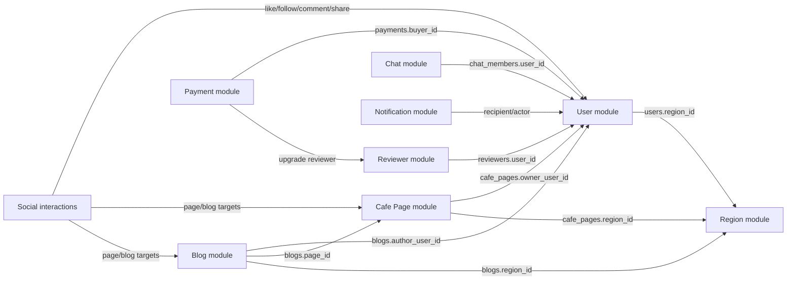
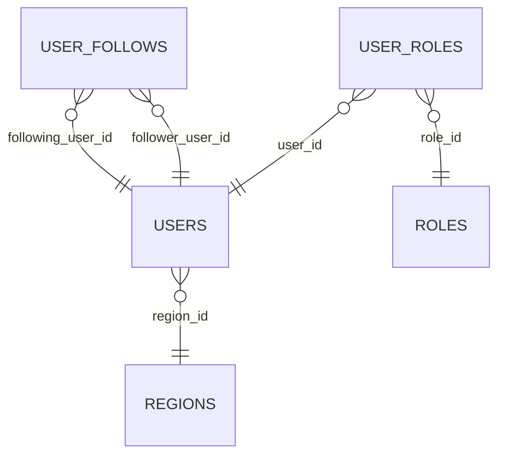
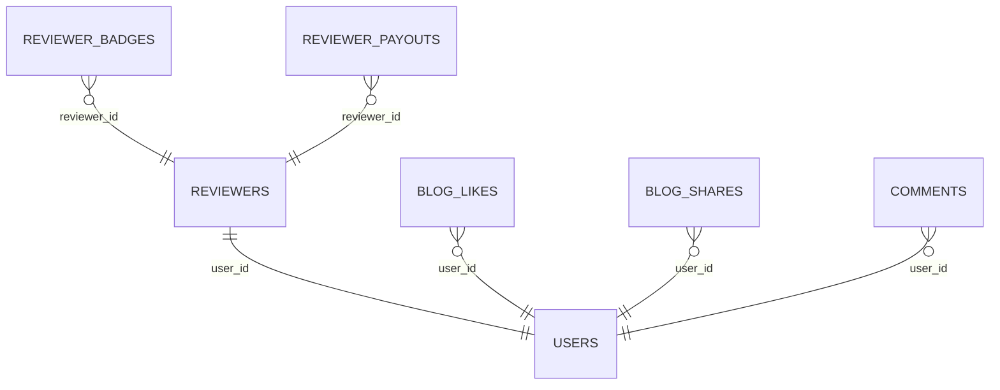
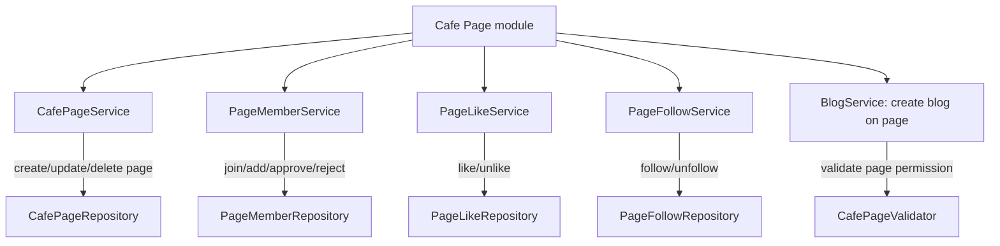
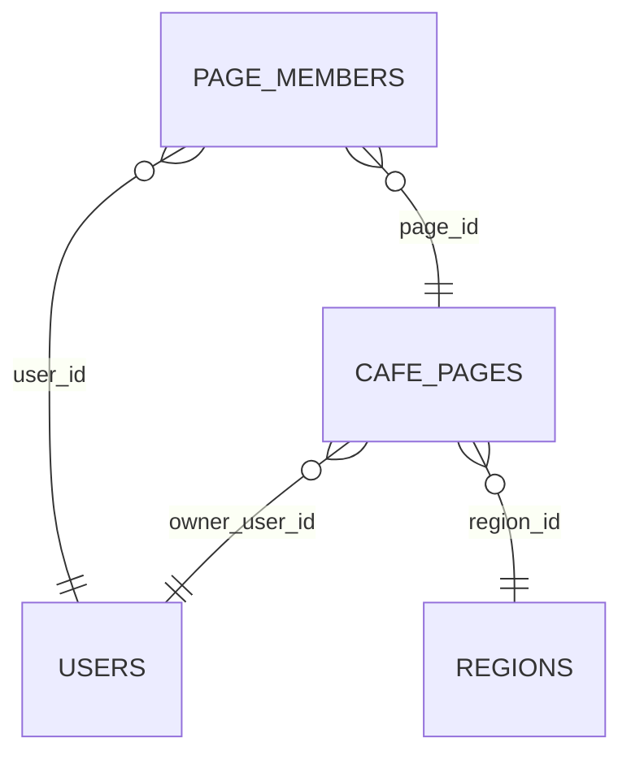
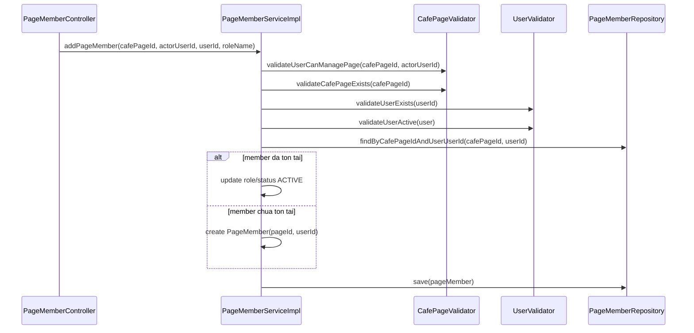
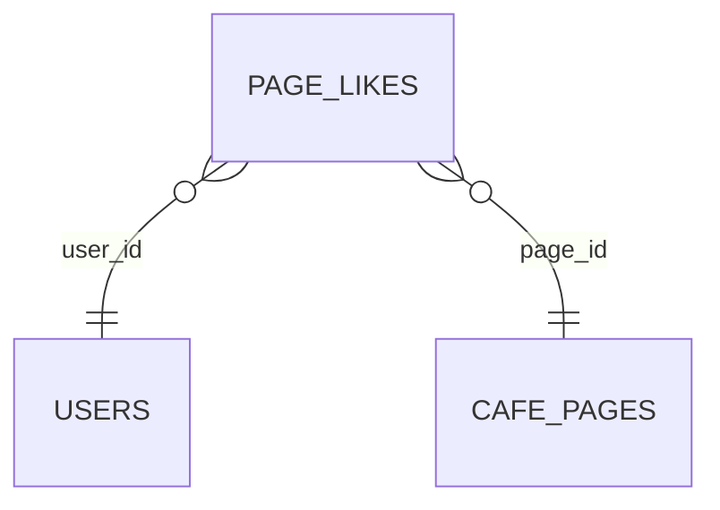
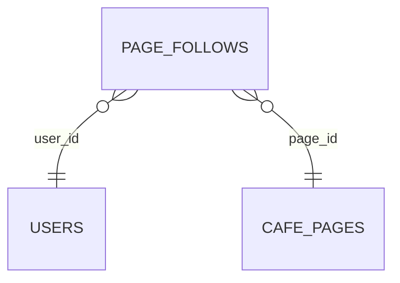
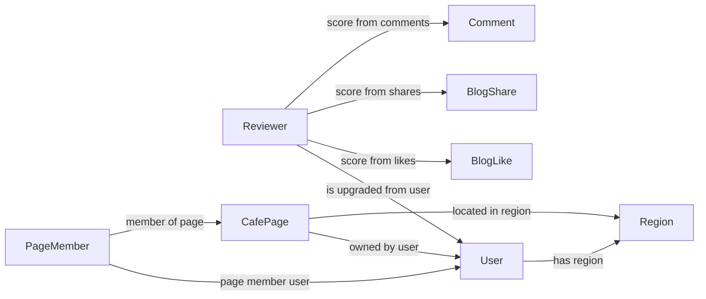
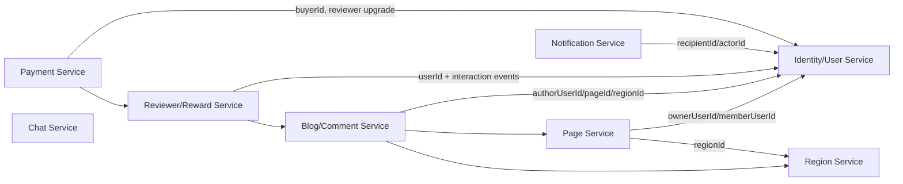

# CafeStory Service Breakdown

Tai lieu nay mo ta cach backend CafeStory dang chia cac service theo module lon, cac module lien ket voi nhau bang UUID/entity relation, va breakdown cac chuc nang nho ben trong tung module.

> Ket luan nhanh: code hien tai la modular monolith. Cac service nhu `UserService`, `ReviewerService`, `CafePageService`, `PageMemberService` chay trong cung mot Spring Boot app, dung chung PostgreSQL, va goi repository noi bo. Day chua phai microservice rieng biet.

## 1. So Do Module Lon



## 2. Service Layer Hien Tai

Backend di theo luong:

```text
Controller -> Service -> Validator/Mapper -> Repository -> PostgreSQL
```

Moi module lon thuong co:

- `Controller`: nhan API request, lay `UUID` tu path/query/body.
- `Service`: xu ly business rule.
- `Validator`: kiem tra entity ton tai/quyen han/trang thai.
- `Repository`: query database bang Spring Data JPA.
- `Mapper`: doi Entity thanh DTO response.

## 3. User Module

### File chinh

- `UserController`
- `UserService`
- `UserServiceImpl`
- `UserRepository`
- `UserValidator`
- `UserMapper`
- Entity: `User`

### Chuc nang nho

- Tao user.
- Lay danh sach user.
- Lay user theo `userId`.
- Cap nhat thong tin user.
- Cap nhat region cua user.
- Xoa user.
- Kiem tra user ton tai.
- Kiem tra user active/inactive.

### Lien ket database



### Cach service dung ID

`UserServiceImpl` nhan `UUID userId` hoac `regionId`, sau do goi:

```java
userValidator.validateUserExists(userId);
regionRepository.findById(regionId);
```

Day la truyen ID noi bo trong cung backend, khong phai goi microservice qua network.

## 4. Region Module

### File chinh

- `RegionRepository`
- Entity: `Region`
- DTO: `RegionRequestDTO`, `RegionResponseDTO`

Hien tai chua co `RegionService` rieng. Region dang duoc dung truc tiep trong:

- `UserServiceImpl`: cap nhat dia chi/khu vuc cua user.
- `CafePageServiceImpl`: gan region cho cafe page.
- `ReviewerServiceImpl`: thong ke reviewer theo `city`, `province`, `area`.

### Chuc nang nho dang co

- Luu thong tin region cho user.
- Gan region cho cafe page.
- Dung region de filter/ranking reviewer.
- Dung region de tinh feed/recommendation theo khu vuc.

### Khi nao nen tach `RegionService`

Nen tach khi co cac API rieng nhu:

- Quan ly danh sach tinh/thanh/quan/huyen.
- Tim region theo city/province/area.
- Chuan hoa dia chi.
- Reuse logic region o nhieu service.

## 5. Reviewer Module

### File chinh

- `ReviewerController`
- `ReviewerService`
- `ReviewerServiceImpl`
- `ReviewerRepository`
- `ReviewerPayoutRepository`
- `ReviewerBadgeHistoryRepository`
- Entity: `Reviewer`, `ReviewerPayout`, `ReviewerBadgeHistory`

### Chuc nang nho

- Tao reviewer tu user.
- Gan role `REVIEWER` cho user.
- Lay reviewer theo `userId`.
- Lay danh sach reviewer.
- Tinh stats theo ngay/tuan/thang/3 thang.
- Tinh score reviewer.
- Tinh payout.
- Tinh badge.
- Tinh segment.
- Tao monthly payout.
- Tao monthly badge.
- Lay lich su payout/badge.
- Ranking reviewer.
- Thong ke reviewer theo khu vuc.

### Lien ket database



### Service phu thuoc module nao

`ReviewerServiceImpl` doc du lieu tu:

- `UserRepository`, `UserValidator`: de biet reviewer la user nao.
- `RoleRepository`, `UserRoleAssignmentRepository`: de gan role reviewer/admin.
- `BlogLikeRepository`, `BlogShareRepository`, `CommentRepository`: de tinh diem reviewer.
- `UserFollowRepository`: de tinh thong tin follow.
- `ReviewerPayoutRepository`, `ReviewerBadgeHistoryRepository`: de luu ket qua thang.

## 6. Cafe Page Module

Day la module lon, ben trong dang co nhieu service nho.



### 6.1 CafePageService

File:

- `CafePageController`
- `CafePageService`
- `CafePageServiceImpl`
- `CafePageRepository`
- `CafePageValidator`
- `CafePageMapper`
- Entity: `CafePage`

Chuc nang nho:

- Tao cafe page.
- Tao owner member mac dinh.
- Tao co-owner khi create page.
- Lay tat ca cafe page.
- Lay page theo owner.
- Lay page theo `cafePageId`.
- Lay blog cua page.
- Cap nhat page.
- Xoa page.

Lien ket:



### 6.2 PageMemberService

File:

- `PageMemberController`
- `PageMemberService`
- `PageMemberServiceImpl`
- `PageMemberRepository`
- Entity: `PageMember`, `PageMemberId`

Chuc nang nho:

- User gui yeu cau tham gia page: `requestToJoinPage(cafePageId, userId)`.
- Owner/co-owner them thanh vien truc tiep: `addPageMember(cafePageId, actorUserId, userId, roleName)`.
- Owner/co-owner approve/reject request: `updatePageMemberStatus(...)`.
- Lay danh sach thanh vien page.
- Lay danh sach thanh vien dang pending.
- Normalize role: `OWNER`, `CO_OWNER`, `MEMBER`.
- Chan them primary owner thanh member lan nua.

Flow them thanh vien:



### 6.3 PageLikeService

Chuc nang nho:

- Like page.
- Unlike page.
- Lay likes theo page.
- Lay likes theo user.
- Cap nhat cached `like_count` cua page.

Lien ket:



### 6.4 PageFollowService

Chuc nang nho:

- Follow page.
- Unfollow page.
- Lay follower cua page.
- Lay danh sach page user dang follow.
- Cap nhat cached `follower_count` cua page.

Lien ket:



### 6.5 Blog tren Page

`BlogServiceImpl` cho phep tao blog gan voi page khi `BlogCreateDTO.pageId` co gia tri.

Rule quan trong nam trong `CafePageValidator.validateUserCanCreateBlogOnPage(...)`:

- User la primary owner cua page thi duoc dang bai.
- Hoac user la `ACTIVE` member voi role `OWNER`/`CO_OWNER`.
- Member role `MEMBER` khong duoc tao blog tren page.

## 7. Quan He User - Reviewer - Page - Region



Doc theo ngon ngu domain:

- `User` la goc cua nhieu module.
- `Reviewer` la mot vai tro/nang cap cua `User`.
- `CafePage` duoc so huu boi `User`.
- `PageMember` noi `User` voi `CafePage` va quy dinh role trong page.
- `Region` la du lieu dia ly dung cho user, page, reviewer ranking/feed.
- `ReviewerService` khong tu tao interaction; no doc tu like/share/comment cua user de tinh diem.

## 8. Co Phai Nen Tach Thanh Microservice Khong?

Hien tai chua nen goi la microservice. Nen goi la cac bounded module trong modular monolith.

Neu sau nay muon tach microservice, co the tach theo huong:



Nhung neu tach that, moi service can them:

- API contract rieng.
- Database ownership rieng hoac schema ownership ro rang.
- Service-to-service communication: HTTP/gRPC/message broker.
- Event flow cho like/comment/share/payment.
- Error handling khi service khac down.
- Idempotency va retry.

Voi quy mo hien tai, cach tot hon la giu monolith nhung viet ro module boundary: controller/service/repository rieng, DTO rieng, validator rieng, va khong de service nay sua data cua service kia qua nhieu.

## 9. Goi Y Breakdown Code Theo Module

Neu muon lam dep lai kien truc ma chua tach microservice, co the gom theo package domain:

```text
com.cafestory.user
  controller
  service
  repository
  dto
  mapper
  validation

com.cafestory.region
  service
  repository
  dto

com.cafestory.page
  controller
  service
  repository
  dto
  mapper
  validation

com.cafestory.reviewer
  controller
  service
  repository
  dto

com.cafestory.blog
  controller
  service
  repository
  dto
```

Day van la mot app Spring Boot, nhung nhin giong cac service rieng hon va de tach microservice sau nay hon.
