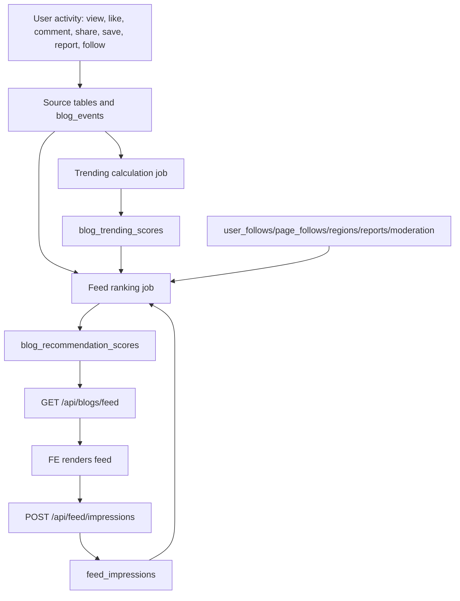

# CafeStory Activity-Based Feed Ranking Logic

## Muc tieu

Tai lieu nay mo ta MVP feed cua CafeStory theo huong **precomputed ranking + realtime read nhanh**.

Muc tieu chinh:

- Tra loi nhanh cho API feed, tranh tinh diem toan bo blog trong moi request.
- Tan dung nen hien co: `blog_events`, `blog_trending_scores`, `blog_recommendation_scores`, follow user/page, report va moderation.
- Giai thich duoc vi sao mot blog duoc uu tien trong feed.
- Giam lap bai da hien thi bang impression/view tracking.
- Dam bao feed khong hien blog bi an, bi xoa, hoac vi pham moderation.

Feed cua CafeStory khong nen copy y chang Facebook. Phien ban MVP nen dung rule-based ranking truoc, sau do moi tinh den recommendation/ML phuc tap hon.

## Van de hieu suat can tranh

Khong nen thiet ke `GET /api/blogs/feed` theo kieu realtime aggregate nang:

```text
GET /api/blogs/feed
-> lay tat ca blog published
-> dem like/comment/share/report tung blog
-> kiem tra follow tung author/page
-> tinh score tung blog
-> sort toan bo
-> map DTO
-> tra response
```

Rui ro cua cach nay:

- De bi N+1 query khi blog, author, page, region, image, like/comment/share tang len.
- Response time tang theo so luong blog va so luong user.
- Moi request deu lap lai cung mot phep tinh.
- Kho dat muc p95 response time duoi 300-500ms khi du lieu lon.

Nguyen tac dung:

```text
GET /api/blogs/feed
-> doc blog_recommendation_scores da tinh san
-> order theo rank_position
-> batch load blog/page/author/image/region
-> map DTO
-> tra response
```

## Kien truc tong quan

Feed duoc chia thanh 4 luong:

```text
1. Activity capture
   User tuong tac voi blog/user/page
   -> ghi event nhe vao bang nguon

2. Aggregation/ranking job
   Job nen chay dinh ky
   -> tong hop event
   -> tinh feed_score
   -> upsert blog_recommendation_scores

3. Fast feed API
   FE goi GET /api/blogs/feed
   -> BE doc cache score
   -> tra danh sach blog da xep hang

4. Feedback loop
   FE gui impression/view theo batch
   -> BE luu bai da hien thi
   -> lan tinh sau giam lap bai cu
```

Luong tong quat:



## Cac activity trong he thong

### Activity dung de tinh ranking

Nhung activity nay nen ghi nhan va tinh diem:

| Activity | Nguon du lieu | Muc dich |
| --- | --- | --- |
| `VIEW` | `blog_events` hoac `feed_impressions` | Biet bai co duoc xem khong |
| `LIKE` | `blog_likes` + optional `blog_events` | Tin hieu tuong tac nhe |
| `COMMENT` | `comments` + optional `blog_events` | Tin hieu tuong tac manh hon like |
| `REPLY` | `comments.parent_comment_id` | Tin hieu thao luan sau hon |
| `SHARE` | `blog_shares` + optional `blog_events` | Tin hieu lan toa manh |
| `SAVE` | `blog_events` hoac bang save rieng | Tin hieu noi dung co gia tri ca nhan |
| `REPORT` | `content_reports` + `blog_events` | Tin hieu am, lam giam ranking |
| `FOLLOW_USER` | `user_follows` | Tang diem bai cua nguoi dang duoc follow |
| `FOLLOW_PAGE` | `page_follows` | Tang diem bai cua cafe page dang duoc follow |

### Activity khong nen hien truc tiep tren feed

Khong phai event nao cung la item trong feed:

- `VIEW`: chi dung de tinh diem/seen penalty.
- `REPORT`: chi dung lam penalty/moderation.
- `SAVE`: co the dung lam score, khong can hien "A da save bai B".

Neu sau nay lam activity feed kieu "ban be vua tuong tac", moi can `user_activity_events`.

## Nguon du lieu va source of truth

Nguon du lieu chinh:

| Nhom | Source of truth |
| --- | --- |
| Blog published | `blogs.status = PUBLISHED` |
| Blog images | `blog_images` |
| Likes | `blog_likes` |
| Comments/replies | `comments` |
| Shares | `blog_shares` |
| Reports | `content_reports`, `blog_events.REPORT` |
| Soft events | `blog_events` |
| Trending score | `blog_trending_scores` |
| Personalized feed cache | `blog_recommendation_scores` |
| User follow | `user_follows` |
| Page follow | `page_follows` |
| Same city | so sanh `regions.city`, khong so sanh `region_id` |
| Moderation block | `ai_moderation_results.decision = VIOLATION` |

Quy tac quan trong:

- Khong xem `blog.like_count`, `blog.comment_count`, `blog.share_count` la source of truth tuyet doi. Neu co thi chi xem la cached counters.
- `blog_recommendation_scores` la cache ranking, khong phai source event goc.
- Feed API nen doc cache score moi nhat thay vi aggregate tat ca event trong request.
- Blog `HIDDEN`, `REMOVED` hoac AI moderation `VIOLATION` khong duoc xuat hien trong feed.

## Cong thuc feed_score

Cong thuc MVP:

```text
feed_score =
  own_author_score
  + followed_author_score
  + followed_page_score
  + same_city_score
  + reviewer_score
  + trending_score * 0.35
  + activity_score
  + freshness_score
  - report_penalty
  - seen_penalty
  - repetition_penalty
```

### Activity score

```text
activity_score =
  views * 0.1
  + likes * 2
  + comments * 4
  + replies * 4
  + shares * 6
  + saves * 5
```

Ly do:

- `LIKE` de thuc hien nhung tin hieu yeu.
- `COMMENT` va `REPLY` cho thay co thao luan, nen manh hon like.
- `SHARE` la tin hieu lan toa, nen manh nhat trong nhom tuong tac.
- `SAVE` cho thay user thay noi dung co gia tri, nen cao hon comment nhe trong MVP.
- `VIEW` de bi spam hoac bi anh huong boi scroll, nen weight thap.

### Social score

Goi y weight ban dau:

```text
own_author_score = 40
followed_page_score = 35
followed_author_score = 30
same_city_score = 15
reviewer_score = 10
```

Giai thich:

- Bai cua chinh user nen duoc hien trong feed cua user de tranh loi "toi dang bai nhung khong thay".
- Bai cua page/user dang follow nen uu tien cao hon bai la.
- Same city dung `regions.city`, vi moi `region_id` co the khac nhau nhung cung thanh pho.
- Reviewer co the duoc bonus nhe, khong nen lan at follow graph.

### Freshness score

```text
freshness_score = exp(-age_hours / 48) * 20
```

Tac dung:

- Bai moi duoc uu tien.
- Bai cu van co co hoi hien neu co interaction tot.
- Toc do giam diem vua phai cho MVP, khong qua gay gat.

### Penalty score

```text
report_penalty = active_reports * 15
seen_penalty = user da thay bai trong feed gan day ? 25 : 0
repetition_penalty = cung author/page xuat hien qua nhieu trong page hien tai ? 10-30 : 0
```

Penalty dung de:

- Giam bai bi report nhieu.
- Giam lap bai da hien thi.
- Giam viec mot author/page chiem ca feed.

## Luong van hanh tung buoc

### 1. Khi user thao tac

Vi du user like/comment/share/save/report/follow:

```text
Request action
-> validate user active
-> validate target ton tai va duoc phep thao tac
-> ghi vao relation/event table tuong ung
-> cap nhat cached counter neu service hien tai yeu cau
-> khong rebuild feed dong bo trong request
```

Khong nen tinh lai feed ngay trong action request, vi se lam action API cham.

### 2. Khi job nen chay

`BlogRecommendationCalculationJob` hien chay moi 15 phut.

Luong nen co:

```text
Job start
-> lay user active can rebuild
-> lay blog published hop le
-> lay latest trending score
-> lay follow graph cua user
-> lay city cua user/blog
-> lay report/moderation state
-> tinh feed_score
-> sort desc
-> gan rank_position
-> upsert blog_recommendation_scores
```

Khong nen rebuild cho toan bo user vo dieu kien khi scale lon. Khi du lieu tang, nen gioi han:

- User active trong 7 ngay gan nhat.
- User vua login.
- User vua follow/unfollow user/page.
- User trong city co bai moi.
- User co cache feed qua cu.

### 3. Khi FE goi feed

API hien tai:

```http
GET /api/blogs/feed?windowType=HOUR_24&page=0&size=20
```

BE nen xu ly:

```text
validate principal
-> tim latest computed_at trong blog_recommendation_scores
-> neu cache con hop le: doc theo rank_position
-> batch load blog/page/author/image/region
-> map BlogFeedResponse
-> tra response
```

Request path chi nen doc nhanh. Khong aggregate likes/comments/shares/reports trong request.

### 4. Khi FE da render feed

FE nen gui batch impression:

```http
POST /api/feed/impressions
```

Body de xuat:

```json
{
  "items": [
    {
      "blogId": "00000000-0000-0000-0000-000000000001",
      "position": 1
    },
    {
      "blogId": "00000000-0000-0000-0000-000000000002",
      "position": 2
    }
  ]
}
```

BE ghi `feed_impressions`, sau do lan tinh score tiep theo co the ap dung `seen_penalty`.

## API de xuat

### API da co

```http
GET /api/blogs/feed
```

Muc dich:

- Tra personalized feed.
- Dung `blog_recommendation_scores` neu co cache moi.
- Fallback sang tinh score hoac organic feed neu cache chua co.

```http
POST /api/blogs/feed/rebuild
```

Muc dich:

- Manual rebuild cho user hien tai.
- Chi nen dung cho test/debug/admin-like flow, khong nen de FE goi lien tuc.

```http
POST /api/blogs/{blogId}/events
```

Muc dich:

- Ghi event blog nhu `VIEW`, `SAVE`, `REPORT`.
- Nen dung can than voi `VIEW`, vi ghi tung view realtime co the tao nhieu write.

### API de xuat them

```http
POST /api/feed/impressions
```

Muc dich:

- FE gui danh sach blog da hien thi theo batch.
- Dung de giam lap bai trong feed.
- Khong thay the `blog_events`; day la view/impression theo ngu canh feed.

```http
GET /api/feed
```

Muc dich phase sau:

- Chuan hoa endpoint feed chung.
- Co the tra mixed feed gom `USER_BLOG`, `CAFE_PAGE_BLOG`, `SPONSORED_CAFE`.
- Hien tai co the giu `GET /api/blogs/feed` de tranh pha contract.

## Bang/index de xuat

### Bang `feed_impressions`

Dung de luu blog nao da hien thi cho user.

```sql
create table feed_impressions (
  id uuid primary key,
  user_id uuid not null,
  blog_id uuid not null,
  position integer,
  shown_at timestamp not null,
  clicked boolean not null default false,
  dismissed boolean not null default false
);
```

Index:

```sql
create index idx_feed_impressions_user_blog_shown
on feed_impressions(user_id, blog_id, shown_at desc);

create index idx_feed_impressions_user_shown
on feed_impressions(user_id, shown_at desc);
```

### Bang `user_activity_events`

Chi can them khi muon activity da doi tuong giong social network.

```sql
create table user_activity_events (
  id uuid primary key,
  actor_user_id uuid not null,
  activity_type varchar(60) not null,
  target_type varchar(60) not null,
  target_id uuid not null,
  object_type varchar(60),
  object_id uuid,
  weight decimal(8, 2) not null default 1,
  created_at timestamp not null
);
```

Vi du:

- User follow user.
- User follow cafe page.
- Cafe page post blog.
- Reviewer post blog.
- User comment on blog.

Khong nen thay the `blog_events` bang bang nay. `blog_events` van phu hop cho blog metrics/trending.

### Index cho cache feed

```sql
create index idx_blog_recommendation_scores_user_window_rank
on blog_recommendation_scores(user_id, window_type, rank_position);
```

Index nay giup `GET /api/blogs/feed` doc nhanh top ranked blogs cua user.

### Index cho event aggregate

```sql
create index idx_blog_events_blog_type_created
on blog_events(blog_id, event_type, created_at desc);

create index idx_blog_events_created
on blog_events(created_at desc);
```

Dung cho job nen tong hop event theo window.

## Fallback khi cache chua co

Khi `GET /api/blogs/feed` khong tim thay cache score:

1. Thu rebuild cache cho user hien tai neu du lieu nho hoac day la lan dau.
2. Neu rebuild cham hoac loi, tra organic feed/trending feed.
3. Khong tra empty list neu van co published blog hop le.

Fallback nen uu tien:

```text
personalized cached feed
-> rebuild current user feed
-> organic feed
-> trending feed
-> empty list
```

Can log ro khi fallback xay ra de debug performance:

```text
feed_cache_miss userId=... windowType=... action=rebuild_current_user
feed_fallback userId=... fallback=organic
```

## Test case can co

### Feed ranking

- User thay bai cua chinh minh trong feed.
- Bai cua followed user duoc boost.
- Bai cua followed cafe page duoc boost.
- Bai cung city duoc boost bang cach so sanh `regions.city`.
- Blog co `trending_score` cao duoc uu tien nhung khong lan at tat ca social signal.
- Blog co report active bi giam rank.
- Blog da hien thi gan day bi giam rank bang `seen_penalty`.
- Nhieu bai cung author/page trong cung page bi giam bang `repetition_penalty`.

### Moderation/status

- Blog `HIDDEN` khong hien trong feed.
- Blog `REMOVED` khong hien trong feed.
- Blog co AI moderation `VIOLATION` khong hien trong feed.

### Performance/cache

- `GET /api/blogs/feed` doc `blog_recommendation_scores` khi cache ton tai.
- `GET /api/blogs/feed` khong aggregate toan bo event trong request path.
- Cache miss co fallback hop ly.
- Batch DTO mapping khong gay N+1 cho author/page/image/region.

### Impression

- `POST /api/feed/impressions` chap nhan nhieu blog trong mot request.
- Duplicate impression gan nhau khong lam hong feed.
- Impression cua user A khong anh huong seen penalty cua user B.

## Rui ro va gioi han MVP

### Rui ro 1: Rebuild cho toan bo user qua nang

Neu so user va blog tang, job `all active users * all published blogs` se ton tai nguyen.

Huong giam tai:

- Chi rebuild user active gan day.
- Chi rebuild khi cache stale.
- Chi rebuild users bi anh huong boi blog moi trong city/follow graph.
- Gioi han candidate blogs theo thoi gian, city, follow va trending.

### Rui ro 2: Ghi view/impression qua nhieu

Neu moi card render deu goi API rieng, DB write se tang nhanh.

Huong dung:

- Gui batch impression.
- Debounce o FE.
- Co the deduplicate theo `(user_id, blog_id, date/hour)` neu can.

### Rui ro 3: Weight chua chinh xac

Weight MVP la rule-based, khong phai ML.

Huong cai tien:

- Log score components.
- So sanh CTR, comment rate, follow rate.
- Dieu chinh weight theo du lieu that.

### Rui ro 4: Feed bi mot page/user chiem qua nhieu

Neu mot cafe page dang nhieu bai va co score cao, feed co the bi lap nguon.

Huong dung:

- Them `repetition_penalty`.
- Gioi han so item toi da cua cung author/page trong mot page response.

## Ket luan

Huong dung cho CafeStory la:

```text
Write path: ghi event nhe
Background path: tinh diem va cache ranking
Read path: doc cache nhanh
Feedback path: ghi impression theo batch de cai thien lan tinh sau
```

Thiet ke nay giu API feed nhanh hon, de debug hon va phu hop voi kien truc backend hien tai cua du an.
