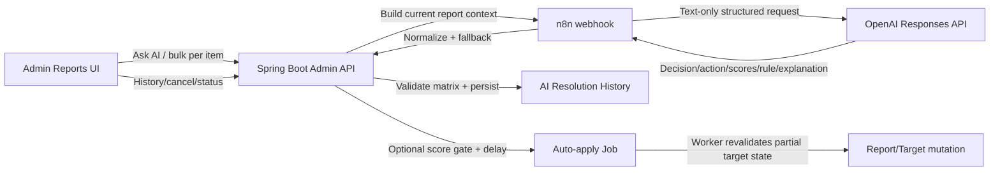

# Current-state Gap Register — Resolve Report with AI V2

## 1. Kiểm soát tài liệu

| Thuộc tính | Giá trị |
|---|---|
| Gate | `G0-06D` |
| Approval | `APPROVE_G0-06D` |
| Trạng thái | `AUDITED_AND_CONSOLIDATED` |
| Input | 17 BE findings, 13 Admin FE findings, 14 n8n findings, 16 DB findings |
| Tổng finding thô | 60 |
| Gap sau loại trùng | 19 |
| Ngày cập nhật | 2026-07-23 |

Tài liệu này mô tả `CURRENT STATE` và khoảng cách với các nguyên tắc đã duyệt. Nó chưa phải Policy Framework, Rule Catalog hoặc implementation plan.

## 2. Kết luận điều hành

Chức năng hiện tại không phải skeleton kỹ thuật đơn thuần. Nó đã có:

- Admin authorization và report eligibility;
- recommendation/history;
- n8n/OpenAI orchestration với structured response;
- Backend validation;
- delayed auto-apply, cancel, replacement và worker;
- bulk UI và per-item failure;
- persistence/migration/test baseline.

Tuy nhiên phần quyết định vẫn là skeleton policy–evidence:

- không có evidence object hoặc burden-of-proof result;
- score không có semantics nhất quán;
- rule code do model tự đặt;
- reason catalog drift giữa source và DB;
- destructive automation rộng hơn baseline đã duyệt;
- UI không cho Admin kiểm tra căn cứ;
- audit/version/security boundary còn thiếu.

Đánh giá readiness:

| Khía cạnh | Mức hiện tại | Kết luận |
|---|---|---|
| Operational workflow | Trung bình–Khá | Có luồng end-to-end về mặt cấu trúc |
| Policy correctness | Thấp | Chưa có policy/rule source of truth |
| Evidence grounding | Thấp | Claim, snapshot và derived AI output chưa phân loại |
| Automation safety | Không đạt V2 baseline | Code allow destructive auto-apply |
| Auditability | Thấp | Thiếu version, evidence reference và correlation |
| Admin decision support | Thấp | UI thiên về conclusion/score/explanation |
| Evaluation readiness | Thấp | Dataset hẹp, score chưa calibrated |

Trạng thái chuyển bước:

```text
READY_FOR_G0-07_POLICY_DRAFT
NOT_READY_FOR_IMPLEMENTATION
NOT_READY_FOR_DESTRUCTIVE_AUTOMATION
```

## 3. Current capability map



Ranh giới đang đúng:

1. n8n không trực tiếp ghi CafeStory database.
2. BE validate và persist.
3. Ask AI không mặc định mutation.
4. Chỉ OPEN/REVIEWING được gửi AI.
5. Invalid decision/action bị fallback hoặc reject.

Ranh giới chưa đạt:

1. Input không gắn trust/provenance.
2. Output không gắn evidence/policy version.
3. Score gate có thể cấp destructive automation.
4. UI không hỗ trợ evidence-first review.

## 4. Priority model

| Priority | Ý nghĩa |
|---|---|
| `P0` | Phải được giải quyết ở G0-07/G0-08/G0-10 trước khi viết Sprint 1 implementation DD |
| `P1` | General hardening phải nằm trong Sprint 1 hoặc acceptance criteria bắt buộc |
| `P2` | Có thể triển khai sau canonical happy path nhưng phải được track |

Priority không phải approval sửa code.

## 5. Consolidated gap register

| ID | Priority | Mức | Class | Gap hợp nhất | Evidence nguồn | Routing khuyến nghị |
|---|---|---|---|---|---|---|
| `CG-001` | P0 | Nghiêm trọng | `MISSING` | Canonical contract không có evidence, counter-evidence, missing evidence, quality/sufficiency hoặc burden result | `SRC-004`, `N8N-004`, `FE-007`, `DB-010` | G0-07 evidence policy → Sprint 1 contract |
| `CG-002` | P0 | Nghiêm trọng | `CONFLICT` | `confidenceScore` và generic `riskScore` không có semantics thống nhất; 16/17 RESOLVE dưới threshold BE | `SRC-005`, `FE-008`, `N8N-006`, `DB-008`, `DB-009` | G0-07 score semantics; deprecate legacy risk |
| `CG-003` | P0 | Nghiêm trọng | `CONFLICT` | Source allow auto-apply `REMOVE/SUSPEND_USER/SUSPEND_PAGE`, trái `HI3/AR3`; safety gate không xét evidence sufficiency | `SRC-006`, `SRC-007`, `FE-006`, `DB-014` | G0-07 automation policy; default A0 |
| `CG-004` | P0 | Cao | `CONFLICT` | Report reason taxonomy không có source of truth: source 9, DB 22, field/label drift, tất cả runtime reasons áp dụng ALL target | `SRC-014`, `SRC-015`, `DB-002`–`DB-005` | G0-07 taxonomy principles; G0-08 catalog |
| `CG-005` | P0 | Cao | `MISSING` | Không có rule catalog/version; model sinh 14 free-form rule codes trên 23 rows | `N8N-014`, `DB-013`, `DB-011` | G0-08 stable rule ID/version |
| `CG-006` | P0 | Cao | `CONFLICT` | Reporter claim, report count và AI moderation output cũ được đưa vào cùng trust level và có thể tăng risk | `SRC-003`, `N8N-003`, `N8N-013` | G0-07 trust/evidence hierarchy |
| `CG-007` | P1 | Cao | `MISSING` | Image URL chỉ là text; không có vision/OCR/fetch validity hoặc mandatory abstention khi ảnh là critical evidence | `N8N-005`; source image context `SRC-004` | Sprint 1 safe abstention; vision path có thể phase sau |
| `CG-008` | P1 | Cao | `MISSING` | Thiếu schema/policy/prompt/workflow version, correlation ID, idempotency key và snapshot hash | `SRC-010`, `N8N-007`, `N8N-009`, `FE-010`, `DB-011` | Sprint 1 audit contract |
| `CG-009` | P1 | Cao | `MISSING` | BE→n8n webhook không có application-level signature, timestamp hoặc replay protection | `SRC-013`, `N8N-008` | Sprint 1 trust-boundary security |
| `CG-010` | P1 | Cao | `CONFLICT` | Execution revalidation chưa đầy đủ cho USER và không revalidate policy/evidence/version; có cancel nhưng chưa có rollback/appeal path sau mutation | `SRC-008`, `SRC-009`; theory `HI7`, `HI8`, `AR5`, `AR10` | Sprint 1 pre-mutation guard; rollback/appeal decision G0-10 |
| `CG-011` | P1 | Cao | `MISSING` | Admin UI không hiển thị evidence/counter/missing/uncertainty/version; copy làm confidence giống safety authority | `FE-006`–`FE-010` | Sprint 1 evidence-first UI |
| `CG-012` | P1 | Trung bình | `MISSING` | Provider/schema/network failure chưa có structured operational error contract; retry chưa chứng minh chỉ transient | `N8N-011`, `N8N-012` | Sprint 1 error taxonomy/retry policy |
| `CG-013` | P1 | Trung bình | `LEGACY` | Raw response được persist/expose; parse error log body preview; chưa có retention/redaction policy | `SRC-011`, `SRC-012`, `FE-011` | G0-07 audit/privacy policy → Sprint 1 DTO/logging |
| `CG-014` | P1 | Trung bình | `MISSING` | DB không enforce score range hoặc decision/action matrix; validation chỉ ở application layer | `DB-012` | G0-11 quyết định constraint ownership |
| `CG-015` | P1 | Cao | `UNKNOWN` | Test/evaluation data không đại diện: không COMMENT/RESOLVED, chỉ 2/22 reasons; tests hiện cover legacy contract | `SRC-017`, `FE-012`, `FE-013`, `DB-007` | G0-09 traceability; Sprint 1 safe fixtures/eval set |
| `CG-016` | P1 | Trung bình | `LEGACY` | Target action `APPROVE` dễ nhầm với business/admin approval; canonical glossary đã chọn `KEEP_VISIBLE` | Current enum/matrix; glossary `D5` | Sprint 1 compatibility adapter |
| `CG-017` | P1 | Trung bình | `CONFLICT` | Bulk UI trộn recommendation success với auto-apply skipped/warning trong cùng summary | `FE-005` | Sprint 1 stage-specific outcome |
| `CG-018` | P2 | Trung bình | `UNKNOWN` | Static n8n export `active:false`; chưa chứng minh published workflow/runtime readiness hoặc current UI/E2E pass | `N8N-002`, `FE-013`, `DB-016` | Runtime verification gate sau implementation |
| `CG-019` | P2 | Trung bình | `LEGACY` | `content_reports` còn `admin_decision/admin_note/reason_type` ngoài entity current | `DB-015` | Data cleanup plan riêng; không block canonical path |

## 6. Gap counts

### Theo classification

| Class | Count |
|---|---:|
| `MISSING` | 8 |
| `CONFLICT` | 6 |
| `LEGACY` | 3 |
| `UNKNOWN` | 2 |
| Tổng | 19 |

### Theo priority

| Priority | Count |
|---|---:|
| `P0` | 6 |
| `P1` | 11 |
| `P2` | 2 |
| Tổng | 19 |

## 7. Những control hiện tại nên giữ

| Control | Evidence | Quyết định |
|---|---|---|
| ADMIN-only route | `SRC-001` | Giữ |
| OPEN/REVIEWING eligibility | `SRC-001`, `FE-002` | Giữ |
| Recommendation tách khỏi immediate mutation | `SRC-002`, `FE-003` | Giữ |
| n8n không mutation CafeStory | `N8N-001` | Giữ |
| n8n normalize + BE validate matrix | `N8N-010`, source matrix | Giữ và mở rộng semantic validation |
| Recommendation/job history | `SRC-002`, schema current | Giữ, bổ sung audit metadata |
| Delay/cancel/replace active job | `SRC-008`, `DB-014` | Giữ |
| Unique active job + `SKIP LOCKED` | `SRC-008` | Giữ |
| Stale BLOG/COMMENT/PAGE skip | `SRC-008`, `SRC-009` | Giữ và mở rộng |
| Bulk per-item failure | `FE-004` | Giữ, tách stage outcome |
| Existing unit/E2E harness | `SRC-016`, `FE-012` | Giữ, đổi contract assertions |
| Current DB referential/cardinality integrity | `DB-006` | Giữ |

## 8. Phản biện các kết luận dễ bị hiểu sai

### “Chức năng chỉ là skeleton”

Đúng nếu nói về policy/evidence reasoning. Không đúng nếu nói về operational plumbing: scheduling, persistence, cancellation, worker và mutation đã tồn tại thật.

### “DB chưa có destructive execution nên code an toàn”

Sai. DB snapshot chỉ cho thấy chưa quan sát destructive job được persist/applied. Source vẫn cấp capability, vì vậy risk là latent capability.

### “Confidence 85 chứng minh recommendation đáng tin”

Sai. Model score chưa calibrated và DB cho thấy cùng confidence 85 nhưng generic risk từ 4.5 đến 75. Confidence không chứng minh violation hoặc sufficiency.

### “22 reasons nghĩa là policy đã chi tiết”

Sai. Reason là reporter-facing claim taxonomy; chúng chưa phải policy rules. Catalog còn overlap, drift và không có version/burden/evidence mapping.

### “Structured JSON nghĩa là AI output đã grounded”

Sai. JSON Schema bảo đảm shape, không bảo đảm evidence, policy correctness hoặc semantic consistency.

## 9. Input bắt buộc cho G0-07

Policy Framework `PROPOSED` phải giải quyết ở mức nguyên tắc:

1. authority boundary giữa AI, n8n, BE và Admin;
2. claim/fact/evidence/provenance;
3. evidence sufficiency và abstention;
4. score semantics;
5. automation baseline/allowlist;
6. policy/rule versioning;
7. privacy/audit/retention;
8. operational failure vs content uncertainty;
9. taxonomy governance;
10. action burden/rollback/appeal.

Không được dùng G0-07 để:

- tự chốt threshold số;
- tự chốt target-specific deep rules;
- sửa database catalog;
- sửa prompt/source;
- tuyên bố runtime pass.

## 10. Decision còn để G0-10

- exact auto-apply allowlist;
- two-person approval;
- role matrix và override authority;
- appeal/rollback SLA;
- retention period;
- policy owner và catalog change authority;
- threshold/calibration acceptance;
- target-specific depth triển khai ngay hay để phase sau.

## 11. Gate conclusion

`G0-06D` đủ evidence để chuyển sang viết Policy Framework bản `PROPOSED`.

Không còn blocker bắt buộc cho việc bắt đầu G0-07. Vẫn chưa được sửa code cho tới khi hoàn thành các gate thiết kế và có final approval `G0-12`.
