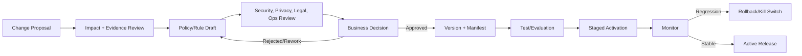

# Policy Change Process

## 1. Kiểm soát tài liệu

| Thuộc tính | Giá trị |
|---|---|
| Gate | `G0-07` |
| Trạng thái | `PROPOSED` |
| Phân loại | Governance |
| Quan hệ | `02-policy-framework/policy-versioning.md` |

## 2. Mục tiêu

Đảm bảo policy/rule/prompt/workflow/action authority không thay đổi âm thầm hoặc chỉ qua chỉnh prompt.

## 3. Change workflow



## 4. Change proposal minimum

```text
changeId
requester
problem/evidence
affected policy/rules/targets/actions
false-positive/false-negative impact
automation impact
privacy/security impact
schema/data migration impact
test/evaluation plan
rollout/rollback plan
open business decisions
```

## 5. Change classes

| Class | Ví dụ | Required review |
|---|---|---|
| Policy semantics | Thay violation criteria/burden | Business + policy + evaluation |
| Action authority | Cho automation/Human Review | Business + safety/security |
| Taxonomy | Merge/add reason/family | Policy + data migration |
| Contract/schema | Add evidence/version fields | Engineering + compatibility |
| Prompt/workflow | Đổi instruction/orchestration | Policy alignment + runtime checksum |
| Model | Đổi provider/model/version | Evaluation + cost/latency/privacy |
| Editorial | Sửa typo không đổi semantics | Lightweight review, patch version |

## 6. Normative governance rules

| ID | Policy |
|---|---|
| `PC-001` | Policy/rule/action change MUST có change ID và evidence basis. |
| `PC-002` | Prompt/workflow change MUST NOT thay policy semantics ngoài approved release. |
| `PC-003` | Business-impacting change MUST có explicit business approval. |
| `PC-004` | Migration MUST tách khỏi policy approval và cần execution approval riêng nếu mutation. |
| `PC-005` | Activation MUST chỉ dùng immutable version/checksum đã test. |
| `PC-006` | Rollback/kill switch MUST tồn tại trước automation activation. |
| `PC-007` | Monitoring MUST phân tách outcome theo rule/action/error type. |
| `PC-008` | Emergency change MUST có scope, expiry, audit và retrospective review. |
| `PC-009` | Legacy data MUST NOT bị rewrite để giả vờ compliant. |
| `PC-010` | Rejected/superseded proposal MUST được lưu trong decision history. |

## 7. Roles đề xuất

| Role | Trách nhiệm | Trạng thái |
|---|---|---|
| Policy owner | Semantics/taxonomy/rule approval | `TBD_G0-10` |
| Business approver | Authority/action/priority | `TBD_G0-10` |
| Engineering owner | Contract/implementation/migration | `TBD_G0-10` |
| Security/privacy reviewer | Trust, data, retention | `TBD_G0-10` |
| Operations owner | Activation/monitor/rollback | `TBD_G0-10` |

Một cá nhân MAY kiêm nhiều role trong đồ án, nhưng audit phải ghi role được thực hiện.

## 8. Emergency change

Emergency change chỉ được dùng để giảm risk tức thời:

- default tắt/giảm automation;
- không được mở rộng destructive authority;
- có expiry;
- có rollback;
- retrospective review bắt buộc;
- tạo normal version/change record sau đó.

## 9. Current catalog reconciliation

Source 9 reasons vs DB 22 reasons cần change proposal riêng:

1. freeze current snapshot;
2. map reason → proposed family/rule;
3. identify merge/deprecate/label correction;
4. assess existing report references;
5. create non-destructive migration plan;
6. business approve;
7. backup/verify;
8. execute mutation bằng approval riêng.

G0-07 không thực hiện các bước mutation này.

## 10. Chưa chốt

- tên người/role;
- approval quorum;
- release cadence;
- emergency authority;
- monitoring thresholds;
- retention.
