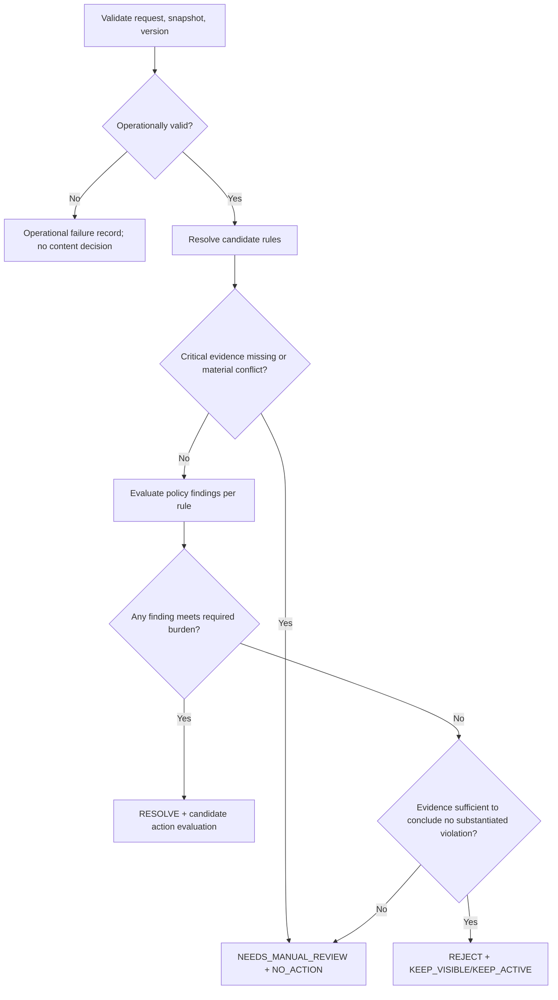

# Report Decision Framework

## 1. Kiểm soát tài liệu

| Thuộc tính | Giá trị |
|---|---|
| Gate | `G0-07` |
| Trạng thái | `PROPOSED` |
| Version draft | `PF-2.0.0-proposed.1` |
| Compatibility | Giữ enum `RESOLVE`, `REJECT`, `NEEDS_MANUAL_REVIEW` trong Sprint 1 |

## 2. Phân biệt ba loại record

| Record | Chủ thể | Ý nghĩa |
|---|---|---|
| AI recommendation | Model/n8n | Đề xuất, không có final authority |
| Admin decision | Human Admin | Quyết định review trong quyền hạn |
| Executed action | Backend | Mutation thực tế sau validation/revalidation |

Ba record MUST có ID, timestamp, actor/version và liên kết nhưng MUST NOT bị ghi đè thành một trạng thái duy nhất.

## 3. Decision semantics

### `RESOLVE`

Report được substantiated theo ít nhất một versioned policy rule và evidence burden cần thiết cho candidate action đã đạt.

`RESOLVE` không tự động cấp quyền mutation. Action vẫn phải qua action framework và authority.

### `REJECT`

Evidence đủ để kết luận report claim không substantiated theo các rule đã đánh giá.

`REJECT`:

- không có nghĩa reporter cố tình nói sai;
- không được dùng chỉ vì thiếu evidence;
- không được dùng để che operational failure;
- phải ghi rule scope đã đánh giá và evidence/counter-evidence.

### `NEEDS_MANUAL_REVIEW`

Abstention có kiểm soát khi:

- critical evidence missing/unreadable;
- evidence material conflict;
- rule/exception/precedence không rõ;
- action cần Human Review;
- model output semantic-invalid nhưng vẫn có context cần điều tra;
- policy/version/citation không hợp lệ;
- harm cao cần urgent review.

Đây là valid outcome, không mặc định là AI failure.

## 4. Decision flow



## 5. Minimum decision record

```text
recommendationId
reportId
targetSnapshotId/hash
policyFrameworkVersion
ruleCatalogVersion
schemaVersion
promptVersion
workflowVersion
modelProvider/modelName/modelVersion
reportDecision
policyFindings[]
evidenceUsed[]
counterEvidence[]
missingEvidence[]
evidenceSufficiency
violationLikelihood
harmSeverity
assessmentConfidence
uncertaintyReasons[]
candidateActions[]
structuredRationale
correlationId
createdAt
```

Không lưu chain-of-thought.

## 6. Normative rules

| ID | Policy |
|---|---|
| `RD-001` | Mỗi decision MUST dựa trên versioned rule set và target snapshot. |
| `RD-002` | Mỗi substantiated finding MUST cite evidence ID và rule version. |
| `RD-003` | Missing critical evidence MUST tạo `NEEDS_MANUAL_REVIEW`, không `REJECT`. |
| `RD-004` | Operational failure MUST tạo error record riêng, không content decision. |
| `RD-005` | `RESOLVE` MUST có ít nhất một finding đạt burden cho candidate action. |
| `RD-006` | `REJECT` MUST có evidence sufficiency để kết luận không substantiated trong evaluated scope. |
| `RD-007` | `NEEDS_MANUAL_REVIEW` MUST đi với `NO_ACTION` ở recommendation level. |
| `RD-008` | Assessment confidence MUST NOT quyết định outcome một mình. |
| `RD-009` | AI recommendation MUST NOT đổi report status hoặc target. |
| `RD-010` | Final Admin decision MUST giữ nguyên AI recommendation để audit, kể cả override. |
| `RD-011` | Override MUST có structured reason; policy-invalid action MUST bị Backend block. |
| `RD-012` | Re-evaluation MUST tạo record/version mới, không sửa recommendation cũ. |
| `RD-013` | Bulk MUST trả outcome theo item và theo stage. |
| `RD-014` | HTTP 2xx MUST NOT được coi là mọi item đã decision/execution thành công. |

## 7. Decision reason codes

Framework đề xuất stable system reason namespace, khác policy rule code:

| Code | Khi dùng |
|---|---|
| `DECISION_RULE_SUBSTANTIATED` | Có finding đạt burden |
| `DECISION_NOT_SUBSTANTIATED` | Evidence đủ nhưng không có finding đạt |
| `DECISION_CRITICAL_EVIDENCE_MISSING` | Thiếu evidence quyết định |
| `DECISION_MATERIAL_CONFLICT` | Evidence mâu thuẫn chưa giải quyết |
| `DECISION_POLICY_EXCEPTION_REVIEW` | Exception/context cần human |
| `DECISION_ACTION_REQUIRES_HUMAN` | Candidate action ngoài automation authority |
| `DECISION_POLICY_VERSION_INVALID` | Rule/policy/citation không hợp lệ |

Operational errors dùng namespace khác, ví dụ `OP_PROVIDER_TIMEOUT`; không dùng decision code.

## 8. Report status mapping

Recommendation không đổi `content_reports.status`.

Final mapping đề xuất:

| Final decision/execution | Report status |
|---|---|
| Chưa final | `OPEN` hoặc `REVIEWING` |
| Final substantiated và action process thành công | `RESOLVED` |
| Final not substantiated | `REJECTED` |
| Manual review pending | `REVIEWING` |
| Execution failed/stale | Không tự đánh dấu resolved; giữ/revert về review state theo DD |

Chi tiết transaction/rollback thuộc G0-11.

## 9. Compatibility

- Sprint 1 giữ enum hiện tại theo glossary `D7`.
- Legacy `APPROVE` được adapter thành canonical `KEEP_VISIBLE`.
- Legacy score được lưu audit-only.
- Existing history không được rewrite thành canonical finding giả.

## 10. Chưa chốt

- ai recommendation tự chuyển report sang REVIEWING hay không;
- Admin role/override matrix;
- two-person approval;
- exact action allowlist;
- SLA manual review.

Chuyển G0-10.
