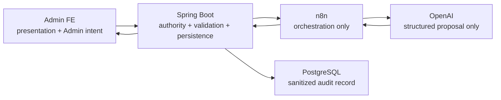

# Architecture Overview — Sprint 1

| Thuộc tính | Giá trị |
|---|---|
| Gate | `G0-11` |
| Trạng thái | `DESIGNED_FOR_G0-12_REVIEW` |
| Source of truth | `09-sprints/sprint-01-safety-contract.md` |

## Component ownership

| Component | Owns | Must not own |
|---|---|---|
| FE | Input intent, rendering, stage-specific outcome | Policy truth, action eligibility |
| BE | Report/target truth, candidate rules, evidence, semantic validation, persistence | Model inference |
| n8n | Authenticated workflow, provider call, schema normalization | CafeStory DB/action/policy |
| Model | Finding proposal within supplied rules/evidence | Rule invention, legal authority, mutation |
| DB | Immutable structured history | Raw secret/provider transcript |

## Hard invariants

1. `automationMode=A0_RECOMMEND_ONLY`.
2. n8n không gọi CafeStory mutation API.
3. Backend không schedule/execute AI auto-apply.
4. Evidence ID phải tồn tại trong request mới được finding tham chiếu.
5. Missing/conflict critical → manual/no action.
6. USER/CAFE_PAGE → local manual-only, không provider call.
7. V2 response không expose `rawResponse`.
8. Version/snapshot/correlation mismatch → fail closed.

## Compatibility

- Endpoint path giữ nguyên.
- Legacy history vẫn đọc được với badge `LEGACY V1`.
- V2 tạo canonical `NO_ACTION/KEEP_VISIBLE`; adapter đọc `NONE/APPROVE`.
- Auto-job history/cancel giữ tạm để xử lý job cũ; creation bị khóa.

## Deployment topology assumption

Thiết kế giả định một active n8n instance cho nonce cache cục bộ. Nếu chạy multi-instance,
replay cache phải chuyển sang shared store trước activation; không được tuyên bố replay protection
đầy đủ chỉ bằng memory-local cache.
