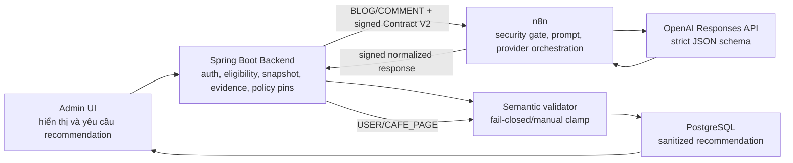

# G0-12F — Detailed Design as-built: Resolve Report with AI V2

## 1. Kiểm soát tài liệu

| Thuộc tính | Giá trị |
|---|---|
| Gate tái tạo tài liệu | `G0-12F` |
| Phạm vi mô tả | Backend → n8n/OpenAI → Backend → Admin UI |
| Nhánh được đối chiếu | `n8n/Ai-agent/fix-bug-report-admin` |
| Source/test HEAD | `9c155ff` |
| Contract | `Admin Report AI Contract 2.0` |
| Automation mode | `A0_RECOMMEND_ONLY` |
| Target phân tích sâu Sprint 1 | `BLOG`, `COMMENT` |
| Target manual-only Sprint 1 | `USER`, `CAFE_PAGE` |
| Trạng thái as-built | `COMPLETED_VERIFIED_APPROVED` |
| Ngày tái tạo | `2026-07-29` |
| Production deployment | `NOT_AUTHORIZED` |

Tài liệu này thay thế phần mô tả tổng hợp cũ vốn dừng ở G0-12C. Nó phản ánh source hiện tại và evidence đã thu
ở G0-12A–G0-12E; không biến kết quả local/disposable thành tuyên bố production-ready.

Trạng thái approval:

- G0-12E đã nhận `APPROVE_G0-12E`;
- G0-12F đã nhận `APPROVE_G0-12F`;
- Sprint 1 vẫn chưa được đóng bằng `G0-12-DONE` cho tới khi có audit Definition of Done riêng.

## 2. Kết luận đúng về chức năng hiện có

Resolve Report with AI V2 hiện là một hệ thống **tạo khuyến nghị hỗ trợ Admin**, không phải hệ thống tự động kết
luận vi phạm hay tự thi hành moderation action.

Những điều hệ thống thực sự làm được:

1. nhận một report đang `OPEN` hoặc `REVIEWING`;
2. đọc target liên kết và tạo snapshot quan sát được tại thời điểm request;
3. route report reason tới tập candidate Rule ID đã pin version;
4. tạo evidence packet tối thiểu từ dữ liệu platform;
5. với `BLOG`/`COMMENT`, gửi packet đã ký sang n8n và OpenAI để tạo output có schema;
6. với `USER`/`CAFE_PAGE`, dừng tại Backend và trả manual-only;
7. kiểm tra lại chữ ký, version, Rule ID, Evidence ID và tổ hợp decision/action tại Backend;
8. clamp mọi kết quả không an toàn thành `NEEDS_MANUAL_REVIEW + NO_ACTION`;
9. lưu recommendation đã chuẩn hóa để Admin xem;
10. không tự resolve report, không đổi target và không tạo auto-apply job mới.

Những điều hệ thống **chưa chứng minh**:

- report của user là đúng;
- target chắc chắn vi phạm policy;
- explanation của AI là evidence;
- score legacy là xác suất vi phạm;
- evidence hiện có đủ cho mọi loại report;
- workflow sẵn sàng production, multi-instance hoặc tải đồng thời lớn;
- policy/rule bản `proposed` đã được duyệt như policy pháp lý/nghiệp vụ cuối cùng.

## 3. Ranh giới sự thật và thẩm quyền

```text
Reporter claim
    ≠ fact
    ≠ evidence độc lập

Target metadata/content snapshot
    → tạo observation có nguồn gốc
    → có thể trở thành evidence input

AI output
    → finding/recommendation có trích Evidence ID
    ≠ evidence mới
    ≠ action authority

Admin
    → xem evidence, finding và giới hạn
    → tự quyết định và thực hiện moderation/report action qua luồng riêng
```

Các semantic đã được khóa:

- thiếu critical evidence → `NEEDS_MANUAL_REVIEW`, không phải `REJECT`;
- `confidence` không đồng nghĩa `violation probability`;
- `evidenceQuality` mô tả chất lượng từng nguồn, không đồng nghĩa `evidenceSufficiency` cho một rule;
- `actionRisk` là rủi ro nếu thực hiện action, không phải mức độ target vi phạm;
- `REJECT` là không đủ căn cứ cho scoped claim và giữ target hiển thị, không phải business approval;
- `RESOLVE` trong AI response chỉ là recommendation state, không tự resolve report.

## 4. Kiến trúc và quyền sở hữu



| Thành phần | Quyền sở hữu |
|---|---|
| Admin UI | Trình bày recommendation/evidence/limitations; không cấp action authority |
| Backend | Authentication, authorization, report eligibility, target snapshot, evidence, policy version, semantic validation, persistence, idempotency, A0 safety |
| n8n | Xác minh request, chống replay trong phạm vi runtime hiện tại, gọi provider, normalize và ký response |
| OpenAI | Sinh structured recommendation theo packet được cấp; không đọc DB và không thực hiện mutation |
| PostgreSQL | Lưu report, target và recommendation V2 đã sanitize |

Backend là trust boundary cuối. n8n và provider không được phép tự ghi database hoặc gọi API moderation để đổi
target/report.

## 5. Luồng xử lý chi tiết

### 5.1. FE → Backend: tạo recommendation

Admin UI gọi:

```http
POST /api/admin/reports/{reportId}/ai-resolution
```

Client hiện tại không bật auto-apply. DTO vẫn chấp nhận các field legacy để tương thích client cũ; nếu request yêu
cầu auto-apply, Backend trả warning A0 và không tạo job.

Backend xác định admin từ authenticated principal. Report chỉ đủ điều kiện khi:

```text
status ∈ {OPEN, REVIEWING}
AND target association còn tồn tại
AND target entity đọc được
```

Report ở trạng thái terminal hoặc mất liên kết target bị từ chối, không “đoán” dữ liệu thay thế.

### 5.2. Backend: tạo target snapshot

Snapshot chứa dữ liệu quan sát được theo target:

- `targetType`, `targetId`;
- text content đã giới hạn;
- image URL/reference;
- trạng thái và timestamp có sẵn;
- với COMMENT: parent blog ID và excerpt;
- `snapshotHash` SHA-256 của JSON quan sát được.

Idempotency key được tạo từ:

```text
reportId | targetType | targetId | snapshotHash |
policyVersion | ruleCatalogVersion | promptVersion | workflowVersion
```

Khi key đã tồn tại, Backend trả record trước đó thay vì gọi provider lại. Từ G0-12E, đường cached/idempotent vẫn
đi qua A0 outcome để giữ warning nếu client legacy yêu cầu auto-apply.

### 5.3. Backend: tạo evidence packet tối thiểu

| Evidence ID | Nguồn | Vai trò | Giới hạn |
|---|---|---|---|
| `EV-TARGET-IDENTITY` | Platform record | Xác định target và association | Không chứng minh nội dung vi phạm |
| `EV-TARGET-CONTENT` | Platform record | Text snapshot | Có thể thiếu ngữ cảnh/ngôn ngữ |
| `EV-TARGET-STATE` | Platform record | Status và timestamp | Chỉ là trạng thái hệ thống |
| `EV-REASON-ROUTE` | Reporter claim | Route candidate rule | `LOW`; không phải proof |
| `EV-PARENT-CONTEXT` | Platform record | Context parent của COMMENT | Chỉ có khi parent đọc được |
| `EV-TARGET-MEDIA` | Media reference | Ghi nhận target có media | Sprint 1 chưa fetch/OCR/vision |
| `EV-DERIVED-MODERATION` | Prior derived result | Tín hiệu tham khảo | `LOW`; không độc lập với AI cũ |

`criticalEvidenceMissing=true` khi, ví dụ:

- text cần đánh giá nhưng không có;
- report phụ thuộc ảnh nhưng media chưa được fetch/đánh giá;
- COMMENT cần parent context nhưng parent không có.

Đánh giá thẳng: evidence hiện tại không còn “trống”, nhưng vẫn là **minimum platform evidence**. Nó đủ để thiết lập
provenance, route rule và chặn kết luận khi thiếu dữ liệu; chưa đủ để gọi tính năng là điều tra vi phạm sâu.

### 5.4. Backend: pin policy và rule

Runtime hiện pin:

```text
policyVersion      = PF-2.0.0-proposed.1
ruleCatalogVersion = RC-2.0.0-proposed.1
reasonVersion      = IRC-2.0.0-proposed.1
promptVersion      = report-ai-v2-sprint1.1
workflowVersion    = cafestory-admin-report-ai-resolution-v2
ruleVersion        = 1.0.0-proposed.1
```

22 report reason code được route tới stable candidate Rule ID. Unknown reason dùng route fallback. Candidate mapping
chỉ thu hẹp phạm vi đánh giá; nó không tạo finding và không chứng minh violation.

Hậu tố `proposed` là giới hạn governance đang mở: source đã pin version nhưng business/legal policy chưa được mô tả
như bản final.

### 5.5. Nhánh USER/CAFE_PAGE

Sprint 1 không gọi provider cho hai target này. Backend tạo local response:

```text
recommendationState = NEEDS_MANUAL_REVIEW
reportDecision       = NEEDS_MANUAL_REVIEW
targetAction         = NO_ACTION
modelName            = backend-policy-guard
evidenceSufficiency  = UNASSESSABLE
```

Thiết kế này cố ý tránh đề xuất suspend user/page từ hồ sơ quá mỏng. Phân tích sâu USER/CAFE_PAGE thuộc cải tiến
sau khi có policy và evidence target-specific.

### 5.6. Nhánh BLOG/COMMENT: Backend → n8n

Backend serialize Contract V2 bằng canonical JSON, tính body SHA-256 và HMAC-SHA256 trên:

```text
timestamp + "\n" + nonce + "\n" + bodyHash
```

Request mang:

- contract version;
- correlation ID;
- timestamp;
- nonce;
- body hash;
- signature.

Secret dùng chung chỉ nằm trong cấu hình runtime Backend/n8n; provider key chỉ thuộc n8n/AI service local, không
nằm trong Backend, FE hoặc mobile.

### 5.7. n8n: security gate và replay protection

Canonical export có 5 node:

1. `Admin Report AI Resolution Webhook`;
2. `Validate Contract V2 And Build Request`;
3. `OpenAI Evidence Recommendation`;
4. `Validate And Normalize Recommendation V2`;
5. `Respond To Backend`.

Node validate:

- yêu cầu đủ signature headers;
- kiểm tra timestamp trong cửa sổ ±120 giây;
- kiểm tra nonce format;
- so contract/correlation header với body;
- canonicalize JSON và so body hash constant-time;
- kiểm tra HMAC constant-time;
- atomic-claim file nonce bằng chế độ `wx`;
- dọn file nonce quá TTL 300 giây;
- chỉ nhận Contract `2.0`, A0, `BLOG`/`COMMENT`, candidate rules và evidence không rỗng.

Export trong repo giữ `active=false` để tránh tự publish khi import. G0-12D đã kiểm chứng một published runtime
active riêng, version `4e221ccf-12a3-4583-8336-c4fda22b5b70`, parity `5/5` node.

### 5.8. n8n → OpenAI: prompt và strict schema

Prompt buộc model:

- coi reporter claim và target text là untrusted data;
- bỏ qua instruction chèn trong content;
- chỉ dùng candidate Rule ID;
- mỗi finding chỉ trích Evidence ID được cấp;
- không coi rationale, report count hoặc prior AI signal là proof;
- thiếu/conflict/unreadable critical evidence → manual/no action;
- không sinh numeric confidence/risk;
- không thực hiện hoặc authorize action.

OpenAI Responses API nhận strict JSON schema gồm:

- recommendation/decision/action;
- findings theo Rule ID/version;
- used/counter/missing Evidence ID;
- blocked reasons;
- evidence quality và sufficiency;
- categorical likelihood/harm severity;
- labels và explanation.

### 5.9. n8n: normalize và ký response

n8n kiểm tra:

- Rule ID và Evidence ID có thuộc request;
- critical evidence missing;
- sufficiency có phải `SUFFICIENT`;
- decision/action combination có hợp lệ.

Nếu có lỗi, n8n trả:

```text
NEEDS_MANUAL_REVIEW + NO_ACTION
findings = []
blockedReasons += reason tương ứng
```

Sau normalize, n8n ký response bằng cơ chế HMAC tương tự request và trả sáu security header cho Backend.

### 5.10. Backend: verify response và semantic clamp lần hai

Backend xác minh signature headers **trước khi parse/trust payload**:

- contract/correlation;
- timestamp freshness;
- nonce format và replay;
- body hash;
- HMAC constant-time.

Sau đó `AdminReportAiSemanticValidator` kiểm tra:

1. contract và correlation;
2. policy/rule/prompt/workflow version pins;
3. enum/categorical values;
4. candidate Rule ID;
5. Evidence ID/counter-evidence reference;
6. critical evidence và sufficiency;
7. target-specific decision/action.

Mọi mismatch, insufficiency hoặc manual state bị clamp thành `NEEDS_MANUAL_REVIEW + NO_ACTION`. Provider response
malformed/thiếu protocol metadata là lỗi integration, không được biến thành kết luận policy.

Backend tự derive `actionRisk`:

| Target action | Action risk |
|---|---|
| `NO_ACTION`, `KEEP_VISIBLE` | `LOW` |
| `HIDE` | `MEDIUM` |
| `REMOVE` | `CRITICAL` |

`actionRisk` chỉ giúp Admin thấy hậu quả tiềm năng của action; nó không làm tăng violation likelihood và không bật
automation.

### 5.11. Backend: persistence

Migration:

```text
V20260723_01__admin_report_ai_contract_v2.sql
```

Migration bổ sung 17 cột V2, 8 CHECK constraint và 2 partial unique index. Record V2 lưu:

- contract/correlation/idempotency/automation mode;
- version pins và snapshot hash;
- categorical semantics;
- findings, evidence summary, blocked reasons;
- explanation và model name.

Record V2 không lưu raw provider payload; numeric `confidenceScore`/`riskScore` để null. Legacy V1 vẫn đọc được,
được đánh dấu compatibility và chỉ hiển thị score như uncalibrated legacy value.

### 5.12. A0 auto-apply quarantine

Service chỉ cho phép cấu hình `A0_RECOMMEND_ONLY`; mode khác làm startup fail. Request mới không tạo auto-apply job.
Legacy job đến hạn chuyển `SKIPPED`, không gọi repository để mutate report/target.

History legacy vẫn đọc được. Job legacy còn `SCHEDULED` có thể được Admin cancel thành `CANCELLED`; luồng cancel
này là thao tác của Admin trên job cũ, không phải AI auto-apply mới.

### 5.13. Backend → FE: response và lịch sử

Response V2 gồm recommendation, evidence summary, findings, blocked reasons, categorical semantics, version metadata
và A0 warning nếu cần. Các endpoint lịch sử:

```http
GET  /api/admin/reports/{reportId}/ai-resolutions
GET  /api/admin/reports/{reportId}/ai-auto-resolutions
POST /api/admin/reports/ai-auto-resolutions/{jobId}/cancel
```

Resolve report và moderation action vẫn là luồng riêng; tạo AI recommendation không gọi chúng.

### 5.14. Admin UI

UI hiện:

- chỉ cho Ask AI với report `OPEN`/`REVIEWING`;
- hỗ trợ single và bulk recommendation tuần tự;
- ghi rõ bulk không resolve report và không đổi target;
- tách `Recommended`, `Needs manual review`, `Failed`, `Remaining`, `Total`;
- hiển thị banner `A0 recommendation-only`;
- hiển thị blocked reasons trước rationale;
- tách evidence sufficiency khỏi evidence quality;
- hiển thị likelihood, harm severity và action risk dạng categorical;
- hiển thị finding theo Rule ID/version và Evidence ID;
- ghi rõ `AI rationale — not evidence`;
- tách `CONTRACT V2` khỏi `LEGACY V1`;
- không render raw provider response;
- chỉ giữ legacy auto-apply history/cancel, không tạo job mới.

## 6. Trạng thái và failure behavior

| Điều kiện | Hành vi mong đợi/đã thiết kế |
|---|---|
| Report terminal hoặc target mất | Từ chối request; không gọi provider |
| USER/CAFE_PAGE | Local manual-only, không gọi n8n |
| Critical evidence thiếu | Manual/no action |
| Unknown Rule/Evidence ID | Manual/no action |
| Version/correlation mismatch | Fail-closed; không trust response |
| Signature/body hash sai | Fail-closed |
| Timestamp stale/future | Reject |
| Nonce replay | Reject |
| Provider schema malformed | Integration error; không giả thành policy result |
| Duplicate idempotency key | Reuse recommendation hiện có |
| Client legacy đòi auto-apply | Không tạo job; trả A0 warning |
| Legacy due job | `SKIPPED`; không mutate target/report |
| n8n negative request trả HTTP 200 body rỗng | Backend vẫn fail-closed vì response unsigned/empty |

Giới hạn quan trọng: Backend response replay cache hiện là in-memory theo process; n8n nonce store là file trên
volume local. Thiết kế chưa chứng minh atomic replay protection trên nhiều Backend/n8n instance dùng chung traffic.

## 7. Traceability triển khai và kiểm chứng

| Gate | Nội dung | Evidence chính | Kết quả |
|---|---|---|---|
| G0-12A | HMAC, freshness, replay source/static | `09-sprints/evidence/2026-07-26T12-14-52-989+07-00/` | Approved; focused `45/45` |
| G0-12B | Changed-class coverage và regression | `09-sprints/evidence/2026-07-26T12-58-33-831+07-00/` | Approved; 5/5 class `100%` line, branch `>=85%`; full `617` |
| G0-12C | PostgreSQL/Flyway/JPA/API disposable runtime | `09-sprints/evidence/2026-07-26T13-26-59-327+07-00/` | Approved; 17/17 cột, 8/8 CHECK, 2/2 index |
| G0-12D | Published n8n/provider/signed response/security | `09-sprints/evidence/2026-07-29T09-53-00-590+07-00/` | Approved; parity `5/5`, exact webhook/provider pass |
| G0-12E | Admin UI/E2E/no-mutation/legacy cancel | `09-sprints/evidence/2026-07-29T11-10-13-870+07-00/` | Approved; effective `30/30` |
| G0-12F | Tái tạo DD as-built và traceability | `09-sprints/evidence/2026-07-29T11-56-02-316+07-00/` | Approved |

Kết quả regression gần nhất từ G0-12E:

- Backend focused: `32/32 PASS`;
- Backend full: `618` tests, `0` failure, `0` error, `1` conditional PostgreSQL integration skip;
- changed class: `100%` line, `87.85%` branch;
- Admin typecheck/build: `PASS`;
- Playwright command: `PASS`;
- automated scenario: `29 PASS`, `1 BLOCKED` vì A0 không tự tạo legacy job;
- supplemental legacy cancel: `PASS`;
- effective acceptance: `30/30 PASS`;
- BLOG/COMMENT/USER/CAFE_PAGE target snapshots: không đổi sau AI recommendation.

G0-12F không sửa source nên không chạy lại toàn bộ runtime suite; nó kiểm chứng traceability và tính nhất quán của
tài liệu dựa trên raw evidence đã lưu.

## 8. Lỗi đã phát hiện và xử lý

| ID | Mức | Vấn đề | Xử lý/trạng thái |
|---|---|---|---|
| `G012-AUTO-001` | Critical | Numeric score có thể dẫn tới auto-apply | Xóa authority/execution path mới; A0 + quarantine |
| `G012-SEC-003` | High | Parse failure có thể log raw response preview | Chỉ log metadata an toàn |
| `G012D-RUNTIME-REPLAY` | Critical | n8n static workflow data không chặn replay ổn định | Thay bằng atomic hashed nonce file; verify qua restart |
| `G012E-CODE-004` | Medium | Cached resolution bỏ qua A0 warning | Đưa cached path qua A0 outcome; regression pass |
| `G012F-DOC-001` | High/document | DD tổng vẫn ghi n8n/UI chưa chạy | Tái tạo file này từ evidence G0-12A–E |

Vấn đề liên quan nhưng ngoài phạm vi G0-12F:

- `ReportModerationJobWorker` legacy có lỗi lazy serialization `imageUrls` với BLOG/COMMENT trong luồng moderation
  cũ; đây không phải Admin Report AI V2 và chưa được che giấu bằng sửa source trong gate tài liệu.

## 9. Rủi ro còn lại và khuyến nghị

### 9.1. Ưu tiên ngay trước khi đóng Sprint 1

1. Chạy audit `G0-12-DONE` và đối chiếu từng tiêu chí Sprint 1 trước khi đóng Sprint.
2. Không deploy production khi chưa có production gate riêng.
3. Ghi rõ Supabase/configured external DB chưa được migrate/repair trong G0-12C/E; evidence schema hiện chỉ là
   disposable PostgreSQL.

### 9.2. Hardening gần

1. Chuẩn hóa n8n error transport để negative request trả HTTP 4xx/5xx có body an toàn, không HTTP 200 rỗng.
2. Thiết kế replay/idempotency store dùng chung nếu chạy nhiều instance.
3. Xử lý unique-conflict idempotency race thành deterministic reuse.
4. Chốt lifecycle policy/rule từ `proposed` sang version đã business/legal review.
5. Tạo safe legacy fixture chính thức để RAI-16 chạy tự động, không cần supplemental setup.
6. Sửa riêng lỗi lazy `imageUrls` của legacy moderation worker và thêm regression.

### 9.3. Cải tiến evidence/policy sâu

1. Trusted media fetch, MIME/hash, OCR/vision và provenance cho report phụ thuộc ảnh.
2. Target-specific evidence cho USER/CAFE_PAGE: identity state, behavioral/temporal signals, prior enforcement có
   provenance và policy hạn chế suspend.
3. External authoritative-source adapter cho các rule cần kiểm chứng ngoài platform.
4. Counter-evidence và conflict-resolution rõ theo từng rule family.
5. Evaluation dataset có nhãn, adversarial/prompt-injection tests, model/provider comparison.
6. Cost/latency/load/observability và rollback drill trước production.
7. Calibration chỉ để nghiên cứu/chất lượng; không khôi phục numeric threshold action authority.

## 10. Rollout và rollback

Rollout production chưa được cấp phép. Khi có gate riêng, thứ tự an toàn nên là:

1. backup database và exported workflow;
2. verify Flyway history, apply immutable migration và restart với JPA `validate`;
3. cấu hình secret qua runtime secret management, không commit;
4. import/publish đúng canonical workflow và kiểm tra node parity;
5. chạy signed canary BLOG/COMMENT và manual-only USER/CAFE_PAGE;
6. kiểm tra no-mutation, audit record, error transport và replay;
7. mở Admin UI theo nhóm nhỏ, theo dõi latency/error/manual-review rate.

Rollback:

- unpublish workflow V2 hoặc tắt webhook integration;
- giữ Backend fail-closed/manual-only;
- không xóa cột V2 trong rollback nóng;
- giữ recommendation history phục vụ audit;
- không tự đổi report/target để “hoàn tác” vì A0 không tạo mutation.

## 11. Definition of Done của tài liệu G0-12F

| Tiêu chí | Trạng thái |
|---|---|
| DD tiếng Việt mô tả BE → n8n → BE → FE | `PASS` |
| Phân biệt implemented, verified, approved và production-ready | `PASS` |
| Trace được về source/evidence G0-12A–E | `PASS` |
| Nêu đúng evidence hiện có và giới hạn | `PASS` |
| Không chứa secret | `PASS` |
| Không sửa source/database/n8n runtime | `PASS` |
| Approval G0-12E | `PASS — APPROVE_G0-12E` |
| Approval G0-12F | `PASS — APPROVE_G0-12F` |
| Sprint 1 closed | `NO` |

**Trạng thái gate tài liệu:** `COMPLETED_VERIFIED_APPROVED`.
