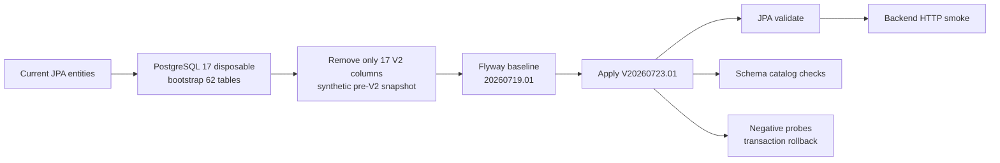

# G0-12C Detailed Design — PostgreSQL/Flyway và Backend runtime

## 1. Document control

| Thuộc tính | Giá trị |
|---|---|
| Gate | `G0-12C` |
| Trạng thái | `COMPLETED_RUNTIME_APPROVED` |
| Approval đã nhận | `APPROVE_G0-12C` |
| Migration | `V20260723_01__admin_report_ai_contract_v2.sql` |
| Evidence | `09-sprints/evidence/2026-07-26T13-26-59-327+07-00/` |
| Source baseline | `f608528` |
| Source thay đổi trong gate | Không |

## 2. Mục tiêu và ranh giới

G0-12C chứng minh bốn điều:

1. Migration Contract V2 chạy được trên PostgreSQL thật.
2. Entity hiện tại tương thích schema sau migration.
3. Backend khởi động và phục vụ HTTP sau migration.
4. Database enforcement chặn các trạng thái nguy hiểm hoặc trùng khóa.

G0-12C không chứng minh:

- production database đã sẵn sàng;
- n8n/provider hoạt động;
- Admin UI hoạt động;
- AI recommendation end-to-end;
- migration tương thích mọi legacy row chưa được đưa vào fixture.

## 3. Kiến trúc runtime kiểm thử



Database chỉ bind localhost `127.0.0.1:55432`. Không dùng cấu hình DB mặc định và không kết nối external DB.

## 4. Thiết kế migration

### 4.1. Cột Contract V2

Migration thêm 17 cột:

| Nhóm | Cột |
|---|---|
| Contract identity | `contract_version`, `correlation_id`, `idempotency_key`, `automation_mode` |
| Version trace | `policy_version`, `rule_catalog_version`, `prompt_version`, `workflow_version` |
| Snapshot/evidence | `target_snapshot_hash`, `evidence_quality`, `evidence_sufficiency` |
| Risk semantics | `violation_likelihood`, `harm_severity`, `action_risk` |
| Structured payload | `findings_json`, `evidence_summary_json`, `blocked_reasons_json` |

### 4.2. Database authority

Tám CHECK constraint giữ các enum/rule quan trọng ở DB:

- contract version chỉ `2.0` hoặc `legacy-v1`;
- automation mode chỉ `A0_RECOMMEND_ONLY`;
- evidence quality và sufficiency tách riêng;
- violation likelihood, harm severity và action risk có catalog riêng;
- `NEEDS_MANUAL_REVIEW` chỉ đi cùng `NO_ACTION` hoặc compatibility alias `NONE`.

Hai partial unique index bảo vệ:

- một `correlation_id` không tạo nhiều resolution;
- một `idempotency_key` không được persist lặp.

## 5. Trình tự triển khai

### 5.1. Bootstrap

DB trắng không phải production snapshot và migration chain của repo bắt đầu bằng delta migration. Vì vậy gate dùng
JPA `create` để dựng schema đầy đủ, sau đó chỉ loại 17 cột V2. Kết quả là một synthetic pre-V2 snapshot có đủ
62 bảng để Backend khởi động mà không cần sao chép dữ liệu production.

### 5.2. Flyway apply

- `baselineOnMigrate=true`;
- baseline version `20260719.01`;
- validate on migrate `true`;
- migration kế tiếp là `20260723.01`.

Flyway history thực tế:

```text
20260719.01 | BASELINE | true
20260723.01 | SQL      | true
```

### 5.3. Backend runtime

Backend chạy với:

- PostgreSQL disposable;
- Flyway enabled;
- Hibernate `validate`;
- data initializer disabled;
- local-only HMAC secret không lưu vào repo/evidence;
- server port `18080`.

Restart lần hai xác nhận migration không chạy lặp và schema đã up-to-date.

## 6. Verification design

### 6.1. Static/build

`mvn '-DskipTests' package` phải tạo executable jar và trả `BUILD SUCCESS`.

### 6.2. Runtime HTTP

| Probe | Expected |
|---|---:|
| `GET /v3/api-docs` | `200` |
| `GET /swagger-ui.html` | `302` |
| `GET /api/admin/reports` không auth | `401` |
| `POST /api/admin/reports/{id}/ai-resolution` không auth | `401` |

Row count trước/sau unauthorized AI POST phải không đổi.

### 6.3. Schema catalog

- kiểm tra đủ 17 cột và PostgreSQL types;
- kiểm tra 8 CHECK constraint có `convalidated=true`;
- kiểm tra 2 index có `indisunique=true` và `indisvalid=true`;
- kiểm tra Flyway history latest version success.

### 6.4. Negative transaction probes

Trong một transaction có rollback:

1. Insert một row V2 hợp lệ.
2. Thử `automation_mode=AUTO_APPLY` → phải bị CHECK chặn.
3. Thử `NEEDS_MANUAL_REVIEW + HIDE` → phải bị CHECK chặn.
4. Thử duplicate correlation → phải bị unique index chặn.
5. Thử duplicate idempotency → phải bị unique index chặn.
6. Rollback và assert row count `0`.

## 7. Kết quả thực tế

| Hạng mục | Kết quả |
|---|---|
| Flyway apply | PASS — applied `20260723.01` |
| Flyway restart | PASS — validated 10 migrations, schema up-to-date |
| JPA validate | PASS |
| Cột/constraint/index | `17/17`, `8/8`, `2/2` |
| Negative probes | `4/4 PASS` |
| API smoke/security | `200/302/401/401` đúng kỳ vọng |
| No mutation | resolution `0`, auto-apply job `0` |
| Focused tests | `63/63 PASS` |
| Full Backend | `617` tests, `0` failure, `0` error, `1` unrelated skip |
| Package | PASS |

## 8. Lỗi phát hiện

### G012C-TEST-001 — TEST_BUG, đã sửa

Probe đầu dùng `NO_VIOLATION`, nhưng canonical decision hiện tại là `RESOLVE/REJECT/NEEDS_MANUAL_REVIEW`.
Probe được sửa thành `REJECT/NO_ACTION`; source/migration không đổi.

### G012C-ENV-002 — CONFIG_ENV, chưa sửa

Repo chưa có integration runtime profile tắt toàn bộ scheduler/custom Redis cache. Backend vẫn start, nhưng log
có background query và Redis warning. Đây là cải tiến môi trường, không phải lý do sửa business source trong gate.

### G012C-DATA-003 — TEST_DATA, residual risk

Synthetic snapshot không có legacy AI resolution. Vì vậy kết quả chỉ chứng minh DDL/schema/runtime trên DB
disposable, không chứng minh toàn bộ data compatibility của production.

## 9. Cleanup

- Backend đã dừng.
- Container `cafestory-g0-12c-postgres` đã dừng, chưa xóa để review.
- Test transaction đã rollback.
- Existing n8n container không bị thay đổi.
- Không có source commit mới vì gate không cần sửa source/migration/test.

## 10. Done boundary

```text
G0-12C STATUS: COMPLETED_RUNTIME_APPROVED
NEXT TOKEN: IMPLEMENT_G0_12D
```

G0-12C đã được chốt bằng `APPROVE_G0-12C`; gate kế tiếp là `G0-12D`.
