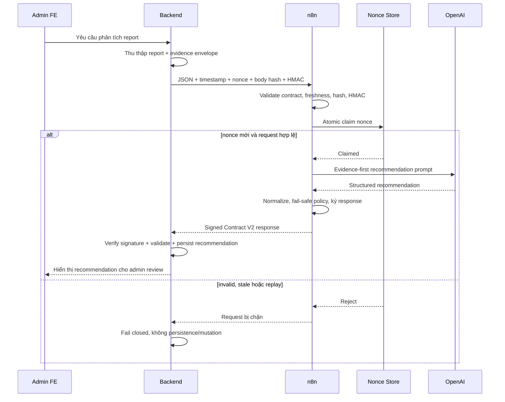

# G0-12D — Detailed Design n8n, OpenAI provider và runtime security

## 1. Trạng thái tài liệu

- Gate: `G0-12D`.
- Trạng thái: `COMPLETED_RUNTIME_APPROVED`.
- Automation mode: `A0_RECOMMEND_ONLY`.
- Production deployment: `NOT_AUTHORIZED`.
- Approval đã nhận: `APPROVE_G0-12D`.
- Evidence: `09-sprints/evidence/2026-07-29T09-53-00-590+07-00/`.

## 2. Bound

### 2.1 Mục tiêu

1. Dùng OpenAI key mới từ `docker/.env` làm nguồn local duy nhất cho các runtime thực sự gọi OpenAI.
2. Cấu hình cùng một `ADMIN_REPORT_AI_HMAC_SECRET` cho Backend và n8n mà không ghi secret vào source, evidence hoặc chat.
3. Publish đúng canonical Admin Report AI V2 workflow.
4. Chứng minh bằng runtime thật:
   - request hợp lệ đi tới provider;
   - response về Backend có chữ ký hợp lệ;
   - replay, stale/future timestamp, chữ ký sai, body bị sửa và thiếu header bị reject;
   - recommendation không tự tạo mutation;
   - thiếu evidence dẫn tới `NEEDS_MANUAL_REVIEW + NO_ACTION`.

### 2.2 Phạm vi được thay đổi

- Canonical workflow JSON trong `docker/`.
- Docker Compose của n8n.
- Script sync secret local và test script trong `docker/tests/`.
- `.env` local/ignored để cấu hình runtime.
- Tài liệu và evidence trong `documents/report-admin/resolve-report-ai-v2/`.

### 2.3 Ngoài phạm vi

- Production deploy.
- Thay đổi UI Admin hoặc chạy UI E2E; phần này thuộc `G0-12E`.
- Đưa OpenAI key vào Backend, frontend hoặc mobile.
- Thay đổi business policy, rule catalog hoặc evidence contract đã approved.
- Tự động resolve report hoặc tạo target action.
- Thiết kế nonce store phân tán cho nhiều n8n instance.

### 2.4 Tiêu chí chấp nhận

| ID | Tiêu chí | Bằng chứng |
|---|---|---|
| AC-01 | OpenAI key mới xác thực thành công | Provider preflight HTTP `200` |
| AC-02 | Chỉ runtime cần key mới được nhận key | AI Python/n8n có key; Backend/FE/mobile không có |
| AC-03 | Backend và n8n dùng cùng HMAC | Boolean equality check, không in giá trị |
| AC-04 | Published workflow khớp canonical repo | `5/5` node parameter hash |
| AC-05 | Request hợp lệ nhận recommendation đã ký | HTTP `200`, provider response và response signature pass |
| AC-06 | Replay/freshness/tamper/signature/header invalid bị chặn trước provider | Runtime execution audit |
| AC-07 | Kết quả an toàn | `NEEDS_MANUAL_REVIEW + NO_ACTION`, không score numeric |
| AC-08 | Backend regression liên quan pass | `37/37`, không failure/error/skip |
| AC-09 | Không lộ secret | Evidence chỉ chứa boolean và status đã sanitize |

## 3. Kiến trúc secret

### 3.1 OpenAI key

`docker/.env` là nguồn local chuẩn. Script `docker/tests/sync-local-openai-secrets.ps1`:

1. đọc `OPENAI_API_KEY` từ `docker/.env`;
2. cập nhật key cho `4-cafe-story-ai-python/.env`;
3. bảo đảm Backend `.env` không giữ `OPENAI_API_KEY`;
4. không in giá trị key;
5. trả về JSON chỉ có các cờ cấu hình.

n8n nhận key qua Docker Compose. AI Python nhận key từ `.env` riêng được đồng bộ. Backend không gọi OpenAI trực tiếp nên không cần key. Frontend/mobile không được nhận provider key vì client-side secret có thể bị trích xuất.

### 3.2 HMAC secret

`ADMIN_REPORT_AI_HMAC_SECRET` là trust boundary Backend ↔ n8n:

- Backend ký request.
- n8n kiểm tra body hash, timestamp, nonce và HMAC.
- n8n ký response.
- Backend kiểm tra chữ ký response trước khi validate/persist.

Script sync tạo secret random 256-bit khi chưa có, ghi cùng một giá trị vào hai `.env` local và chỉ xuất kết quả so khớp dạng boolean.

### 3.3 N8N encryption key

`N8N_ENCRYPTION_KEY` không được tự động rotate trong gate này. Key đó bảo vệ credential của n8n trên volume hiện hữu; thay đổi thiếu backup/restore drill có thể làm credential không giải mã được. Đây là hardening trước production, không phải blocker của local runtime gate.

## 4. Workflow runtime

### 4.1 Canonical workflow

- Workflow ID: `cafestory-admin-report-ai-resolution-v2`.
- Published version: `4e221ccf-12a3-4583-8336-c4fda22b5b70`.
- Source/test commit: `7168af7`; không chứa documents, `.env` hoặc secret.
- Node parity: `5/5`.
- Repo export vẫn để `active=false` để import không vô tình publish; runtime publish là hành động có kiểm soát.

### 4.2 Provider request

Prompt yêu cầu recommendation dựa trên evidence, không biến AI explanation thành evidence và không trao quyền mutation. Output được normalize theo Contract V2. Trường hợp evidence không đủ phải trả:

- `reportDecision = NEEDS_MANUAL_REVIEW`;
- `recommendationState = NEEDS_MANUAL_REVIEW`;
- `targetAction = NO_ACTION`.

Các numeric field như `riskScore`, `confidenceScore` không được dùng làm authority.

## 5. Replay protection

### 5.1 Lỗi runtime đã phát hiện

**Lỗi critical:** bản đầu dùng `$getWorkflowStaticData('global')`. Static validator pass nhưng hai request runtime dùng cùng nonce đều có execution `success`. Vì vậy cơ chế này không đủ bằng chứng chống replay trong runtime n8n hiện tại.

### 5.2 Thiết kế đã sửa

Canonical workflow dùng nonce file store trên volume `/home/node/.n8n`:

1. hash nonce bằng SHA-256 để không dùng input thô làm filename;
2. tạo thư mục mode `0700`;
3. claim nonce bằng `fs.openSync(path, 'wx', 0o600)`;
4. cờ `wx` bảo đảm create-if-absent atomic;
5. file đã tồn tại nghĩa là replay và request bị reject;
6. dọn file quá TTL 300 giây;
7. Docker Compose chỉ allow built-in module `crypto,fs`.

Kết quả runtime: execution `215` success; replay cùng nonce ở execution `216` error. Số file nonce giữ nguyên qua restart (`4 → 4`).

### 5.3 Giới hạn

File store là baseline cho một n8n instance/volume. Trước khi scale horizontally phải chuyển sang Redis hoặc PostgreSQL với atomic create-if-absent và TTL dùng chung.

## 6. Xử lý lỗi và fail-closed

Backend không tin response nếu:

- body rỗng;
- thiếu response signature;
- HMAC sai;
- response không đúng Contract V2;
- recommendation vi phạm safety invariant.

**Điểm cần cải tiến:** n8n `2.28.6` hiện trả transport HTTP `200` body rỗng khi Code node `throw`, dù execution được ghi đúng là `error`. Luồng vẫn fail-closed vì không có signed response, nhưng observability/API semantics chưa tốt. Trước production nên thay `throw` bằng nhánh response lỗi sanitize với status `400/401/403/409`.

## 7. Execute theo FE → BE → n8n

### 7.1 Frontend

- Không thay đổi ở G0-12D.
- Không có OpenAI key ở frontend.
- UI chỉ hiển thị recommendation sau khi Backend đã xác thực và persistence.
- UI E2E thuộc G0-12E.

### 7.2 Backend

- Không nhận OpenAI key.
- Dùng `ADMIN_REPORT_AI_HMAC_SECRET` để ký request và kiểm tra response.
- Fail closed với response rỗng/unsigned/invalid.
- Focused regression: `AdminReportAiWebhookSignerTest` và `AdminReportAiResolutionServiceImplTest`.

### 7.3 n8n

- Nhận OpenAI key và HMAC qua environment.
- Validate request trước provider.
- Atomic claim nonce trước provider.
- Gọi OpenAI `gpt-4o-mini`.
- Normalize về Contract V2 và áp safety fallback.
- Ký response cho Backend.

## 8. Verify

| Kiểm tra | Kết quả thực tế |
|---|---|
| OpenAI `/v1/models` từ container n8n | HTTP `200` |
| AI Python settings/client init | `PASS` |
| Secret sync fixture | `PASS` |
| Docker Compose config | `PASS` |
| Static workflow security | Tất cả case `PASS` |
| Exact webhook valid request | HTTP `200`, provider response có, response signature hợp lệ |
| Replay | Execution `error` |
| Stale timestamp | Execution `error` |
| Future timestamp | Execution `error` |
| Invalid signature | Execution `error` |
| Tampered body | Execution `error` |
| Missing headers | Execution `error` |
| Published parity | `5/5` |
| Backend focused tests | `37/37 PASS` |
| Nonce persistence qua restart | `PASS` |
| Secret xuất hiện trong evidence | `0` |

## 9. Evidence

- `raw/runtime-provider-matrix.json`: runtime matrix đã sanitize.
- `raw/runtime-execution-audit.json`: status/error theo execution, không có payload/secret.
- `raw/node-parity.json`: hash parity canonical ↔ published.
- `logs/security-static-validator.log`: static security suite.
- `logs/secret-sync-and-provider-preflight.log`: readiness boolean và provider preflight.
- `logs/backend-focused-tests.log`: focused Backend regression.
- `issue.md`: issue classification.
- `fix-log.md`: repair loop.
- `workflow-improvement.md`: backlog hardening.

Raw workflow backup/export có thể chứa cấu hình workflow nhưng không chứa giá trị `.env`; không được dùng chúng làm kênh chuyển secret.

## 10. Rollback

Nếu runtime regression:

1. unpublish exact workflow ID;
2. giữ Backend fail-closed;
3. restore workflow backup theo exact ID/version đã lưu;
4. không thay `N8N_ENCRYPTION_KEY`;
5. không xóa volume trước khi xác minh backup;
6. kiểm tra exact webhook và signature trước khi publish lại.

## 11. Kết luận và gate

G0-12D đã có implementation và runtime evidence cho provider, HMAC, freshness, replay, response signature và safe recommendation. Người dùng đã review và chốt gate bằng `APPROVE_G0-12D`.

G0-12D không cấp production authority và không thay thế G0-12E Admin UI E2E. Bước kế tiếp là `IMPLEMENT_G0_12E`.
