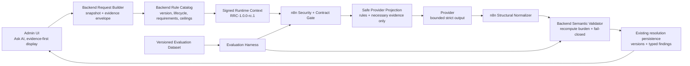

# S2-DD-01 — Detailed Design Sprint 2: Runtime Rule–Evidence–Prompt–Evaluation

## 1. Kiểm soát tài liệu

| Thuộc tính | Giá trị |
|---|---|
| Gate | `S2-DD-01` |
| Token thực hiện | `IMPLEMENT_S2_DD_01` |
| Prerequisite | `APPROVE_S2_REBASE_01` — đã nhận |
| Trạng thái | `COMPLETED_DESIGN_AWAITING_APPROVAL` |
| Approval cần nhận | `APPROVE_S2_DD_01` |
| Nhánh khảo sát | `n8n/Ai-agent/fix-bug-report-admin` |
| Source HEAD | `9c155ff46570b0e1d3a151c4a64fa8e2dc5fd6cf` |
| Contract ngoài | Giữ `Admin Report AI Contract 2.0` |
| Context schema mới | `RRC-1.0.0-rc.1` — PROPOSED |
| Evidence envelope | Tái sử dụng M07 `1.0.0-rc.1` theo safe provider projection |
| Automation | Giữ `A0_RECOMMEND_ONLY` |
| Target | BLOG/COMMENT; USER/CAFE_PAGE manual-only |
| Source/runtime thay đổi trong DD | Không |
| Production authority | `NOT_AUTHORIZED` |

Tài liệu này là thiết kế source-backed cho toàn Sprint 2. Nó không tự sửa code, activate policy,
publish n8n hoặc mở benchmark provider.

## 2. Bound

### 2.1. Mục tiêu

Thiết kế cầu nối từ Policy–Evidence dossier đã approved sang runtime hiện tại để:

1. Backend truyền rule/evidence burden có version thay vì chỉ Rule ID;
2. n8n tạo prompt từ rule context do Backend cấp, không sở hữu catalog song song;
3. provider output bị giới hạn bằng bounded strict schema;
4. Backend tái kiểm tra per-rule burden và complete evaluation scope;
5. evaluation harness đo đúng safety/semantic/model quality theo từng lớp;
6. Admin UI không biến output hoặc policy `PROPOSED` thành action authority.

### 2.2. Trong phạm vi thiết kế

- `S2-01` Runtime Rule Context và Evidence Projection Contract;
- `S2-02` Schema + Semantic Invariant Hardening;
- `S2-03` Evaluation Dataset/Harness V1;
- `S2-04` Rule-family Prompt Pilot;
- `S2-05` conditional provider/model benchmark;
- test, rollout, rollback, evidence và gate sequence.

### 2.3. Ngoài phạm vi

- implementation source;
- database migration;
- activate `PF-2.0.0-proposed.1` hoặc `RC-2.0.0-proposed.1`;
- numeric calibration/probability/threshold;
- auto-action hoặc report auto-resolution;
- USER/CAFE_PAGE deep evidence;
- OCR/vision, legal/IP intake hoặc authoritative external adapter;
- xử lý production readiness, monitoring, rollback drill hoặc multi-instance replay;
- production deployment.

## 3. As-is đã xác thực

### 3.1. Backend outbound

`AdminReportAiResolutionServiceImpl` hiện:

- tạo `reportClaim`, `targetSnapshot`, `evidence[]`, `policyContext`, `executionConstraints`;
- `policyContext` chỉ có policy version, catalog version và candidate rules;
- evidence item là map rút gọn:
  `evidenceId/sourceType/observation/provenance/capturedAt/quality/availability`;
- idempotency đã pin policy/rule/prompt/workflow version;
- USER/CAFE_PAGE bị dừng local manual-only.

### 3.2. Rule catalog

`AdminReportAiPolicyCatalog` hiện:

- mapping 22 reason code tới Rule ID;
- candidate rule chỉ có `ruleId` và một `ruleVersion` chung;
- version policy/catalog/rule đều mang hậu tố `proposed`;
- chưa materialize M06 requirement profile, evidence kind, exception, current ceiling hoặc action burden.

### 3.3. n8n/provider

Canonical workflow hiện:

- xác minh HMAC, timestamp, nonce, body hash và A0;
- chỉ cho provider path với BLOG/COMMENT;
- tạo một strict output schema inline;
- dùng system prompt chung tám invariant;
- gửi toàn bộ request body đã stringify làm user message;
- normalize Rule/Evidence reference và clamp các combination không an toàn.

### 3.4. Backend inbound

`AdminReportAiSemanticValidator` hiện:

- pin contract/correlation và policy/rule/prompt/workflow version;
- validate categorical semantics;
- kiểm tra Rule ID/Evidence ID allowlist;
- cấm reporter claim/derived signal là positive evidence duy nhất;
- clamp missing/insufficient/invalid về manual/no-action;
- kiểm tra decision/action theo target.

Chưa enforce:

- finding `ruleVersion`;
- policy/catalog lifecycle status;
- evidence kind và requirement profile;
- complete evaluation của mọi material candidate rule;
- conditional/missing/counter/exception burden;
- per-rule evaluation ceiling;
- action-specific burden.

### 3.5. Admin UI

Admin UI đã hiển thị:

- blocked reasons;
- evidence sufficiency;
- likelihood/harm/action risk;
- findings và evidence references;
- model, policy, rule catalog và prompt version;
- warning rằng AI không cấp action authority.

Sprint 2 không cần thay đổi endpoint hoặc tạo màn hình mới để triển khai core contract.

## 4. Lỗi/rủi ro phải highlight

### `S2DD-CRITICAL-001` — PROPOSED catalog chưa bị fail-closed ở runtime

M06 quy định policy/rule version chưa `ACTIVE` không được tạo `RESOLVE/REJECT`. Runtime hiện chỉ so
version string và chưa mang lifecycle status. Vì vậy một version có hậu tố `proposed` vẫn có thể đi
qua provider/validator như version hợp lệ.

Thiết kế bắt buộc:

```text
policyStatus != ACTIVE
OR ruleCatalogStatus != ACTIVE
OR ruleStatus != ACTIVE
→ evaluationMode = PROPOSED_EVALUATION_ONLY
→ final decision = NEEDS_MANUAL_REVIEW
→ final action = NO_ACTION
→ blockedReason = POLICY_OR_RULE_CATALOG_NOT_ACTIVE
```

Provider có thể được gọi trong evaluation-only để tạo research evidence nếu gate cho phép, nhưng
Backend không được persist nó như actionable `RESOLVE/REJECT`.

### `S2DD-HIGH-002` — Runtime evidence chưa compliant Common Evidence Envelope

Evidence map hiện vẫn dùng free-text `observation` và thiếu:

- `evidenceKind`;
- subject snapshot binding;
- structured source/capture/integrity;
- structured availability/quality reason;
- privacy/intended use;
- `collectedForRuleIds`.

Không có các field này thì Backend không thể chứng minh một required Evidence Kind của M06 đã được
thỏa.

### `S2DD-HIGH-003` — Strict schema chưa bounded đầy đủ

Provider schema có closed properties và enum nhưng chưa giới hạn đầy đủ string/array/reference.
Thiết kế và runtime chưa hoàn toàn khớp.

### `S2DD-HIGH-004` — Prompt đang nhận toàn bộ request body

`JSON.stringify(body)` đưa cả audit/security metadata không cần thiết vào provider input. Nó tăng
data exposure, token cost và coupling. Sprint 2 phải tạo safe provider projection.

### `S2DD-HIGH-005` — Complete evaluation scope chưa enforce

Một candidate rule được support không được bù cho candidate rule material khác còn missing,
conflicted hoặc chưa đánh giá. Đây là điều kiện bắt buộc để phân biệt:

- `NOT_SUBSTANTIATED`;
- `UNASSESSABLE`;
- `NEEDS_MANUAL_REVIEW`;
- `REJECT`.

## 5. Kiến trúc to-be



Quyền sở hữu:

| Thành phần | Sở hữu | Không được sở hữu |
|---|---|---|
| Admin UI | request/display, limitations | policy truth, evidence sufficiency, action authority |
| Backend catalog | rule metadata, lifecycle, requirement, ceiling | model prose |
| Backend evidence builder | snapshot binding, Evidence Kind, provenance, availability/quality | invented observation |
| n8n | signature gate, projection, prompt assembly, provider orchestration | catalog độc lập, DB mutation |
| Provider | structured candidate evaluation | evidence creation, rule invention, action execution |
| Backend validator | final semantic authority và manual clamp | calibration claim |
| Evaluation harness | reproducible measurement | production policy activation |

## 6. Quyết định versioning

### 6.1. Giữ outer contract `2.0`

Không đổi DB/endpoint chỉ để thêm structured content vào `policyContext` và `evidence[]`.

Thêm các version pin:

```text
policyContext.contextSchemaVersion = RRC-1.0.0-rc.1
policyContext.requirementMatrixVersion = 1.0.0-rc.1
policyContext.evidenceKindCatalogVersion = 1.0.0-rc.1
evidence[].envelopeVersion = 1.0.0-rc.1
```

Khi implementation thay prompt/workflow behavior:

```text
promptVersion   = report-ai-v2-sprint2.<n>
workflowVersion = cafestory-admin-report-ai-resolution-v2-s2.<n>
```

Mọi thay đổi semantic phải bump version và idempotency key. Không sửa content dưới cùng version.

### 6.2. Không tự activate policy

Version hiện tại tiếp tục:

```text
policyStatus = PROPOSED
ruleCatalogStatus = PROPOSED
ruleStatus = PROPOSED
evaluationMode = PROPOSED_EVALUATION_ONLY
```

Chỉ business gate riêng mới được đổi `ACTIVE`.

## 7. S2-01 — Runtime Rule Context và Evidence Projection Contract

### 7.1. Backend typed model

Thay các map lõi bằng DTO/value objects typed ở API boundary:

```text
AdminReportAiPolicyContextRequestDTO
AdminReportAiCandidateRuleRequestDTO
AdminReportAiRuleRequirementRequestDTO
AdminReportAiEvidenceItemRequestDTO
AdminReportAiMissingRequirementRequestDTO
```

Không cần đổi Controller hoặc public Admin endpoint. Đây là internal Backend → n8n contract.

### 7.2. `policyContext`

```json
{
  "contextSchemaVersion": "RRC-1.0.0-rc.1",
  "policyVersion": "PF-2.0.0-proposed.1",
  "policyStatus": "PROPOSED",
  "ruleCatalogVersion": "RC-2.0.0-proposed.1",
  "ruleCatalogStatus": "PROPOSED",
  "requirementMatrixVersion": "1.0.0-rc.1",
  "evidenceKindCatalogVersion": "1.0.0-rc.1",
  "evaluationMode": "PROPOSED_EVALUATION_ONLY",
  "candidateRules": []
}
```

### 7.3. Candidate rule

Mỗi candidate rule MUST có:

```text
ruleId
ruleVersion
ruleStatus
ruleFamily
ruleType
material
applicableTargetTypes[]
requirementProfileIds[]
requiredEvidenceKinds[]
conditionalRequirements[]
semanticRequirementCodes[]
counterEvidenceRequired
exceptionCodes[]
evaluationCeiling
allowedOutcomes[]
allowedCandidateActions[]
```

Các clause là immutable catalog data. Không dùng target/report text để tạo clause.

### 7.4. Evidence envelope và safe projection

Backend xây evidence theo M07 evidence item:

```text
evidenceId
envelopeVersion
evidenceKind
subject
source
capture
integrity
availability
quality
privacy
intendedUse
collectedForRuleIds
payload
```

n8n không gửi toàn bộ request body sang provider. Nó chỉ tạo:

```json
{
  "target": {
    "targetType": "BLOG",
    "snapshotVersion": "1",
    "sanitizedFields": {}
  },
  "candidateRules": [],
  "evidence": [
    {
      "evidenceId": "EV-TARGET-CONTENT",
      "evidenceKind": "TARGET_TEXT_CONTENT",
      "availability": "AVAILABLE",
      "quality": "HIGH",
      "intendedUse": "RULE_EVALUATION_CANDIDATE",
      "sanitizedPayload": {}
    }
  ],
  "missingRequirements": [],
  "executionConstraints": {
    "recommendationOnly": true
  }
}
```

Không gửi:

- reporter identity/contact;
- internal entity locator;
- secret/HMAC metadata;
- raw prior AI output;
- same-target report count như evidence;
- fields `RESTRICTED/LEGAL_RESTRICTED` nếu chưa có provider disclosure approval.

### 7.5. Backend pre-evaluation

Backend phải tính trước:

```text
available required Evidence Kinds
missing/partial/stale Evidence Kinds
triggered conditional requirements
missing semantic requirements
policy/rule lifecycle
current evaluation ceiling
```

Provider được yêu cầu đánh giá observation trong phạm vi còn lại, không được tự quyết evidence
requirement nào là optional.

### 7.6. S2-01 acceptance

- typed rule/evidence context;
- unique Rule/Evidence IDs;
- subject snapshot hash khớp target;
- lifecycle status và evaluation mode có mặt;
- USER/CAFE_PAGE dừng trước provider;
- safe provider projection không chứa field ngoài allowlist;
- old Map-based tests được thay bằng typed assertions;
- changed production files đạt line `100%`, branch `>=85%`;
- focused và full Backend regression pass.

## 7A. As-built S2-01 — sau implementation

### 7A.1. Trạng thái

```text
IMPLEMENT_S2_01
→ Backend typed Runtime Rule Context
→ Backend typed Common Evidence Envelope
→ n8n allowlisted provider projection
→ Backend + n8n lifecycle fail-closed
→ focused/full regression + coverage
→ COMPLETED_VERIFIED_AWAITING_APPROVAL
```

S2-01 không activate policy. Trạng thái runtime vẫn là:

```text
policyStatus       = PROPOSED
ruleCatalogStatus  = PROPOSED
ruleStatus         = PROPOSED
evaluationMode     = PROPOSED_EVALUATION_ONLY
evaluationCeiling  = NEEDS_MANUAL_REVIEW
```

Vì vậy provider có thể được dùng cho đánh giá thử ở môi trường được phép, nhưng recommendation
không có authority để trở thành `RESOLVE/REJECT`; Backend và n8n đều clamp về:

```text
NEEDS_MANUAL_REVIEW + NO_ACTION
blockedReason = POLICY_OR_RULE_CATALOG_NOT_ACTIVE
```

### 7A.2. Backend — typed Runtime Rule Context

`AdminReportAiResolutionRequestDTO.policyContext` không còn là raw `Map`. Runtime dùng:

```text
AdminReportAiPolicyContextRequestDTO
  ├─ version/lifecycle/evaluationMode
  ├─ candidateRules[]
  ├─ availableEvidenceKinds[]
  ├─ missingRequirements[]
  └─ currentEvaluationCeiling

AdminReportAiCandidateRuleRequestDTO
  ├─ identity/version/status/family/type/material
  ├─ target applicability
  ├─ requirement profiles
  ├─ required/conditional/semantic requirements
  ├─ counter-evidence/exceptions
  └─ outcome/action ceilings
```

Catalog là nguồn duy nhất sinh candidate rule metadata. Report text và model output không được dùng
để tạo hoặc mở rộng rule clause.

Backend pre-evaluation tính:

1. Evidence Kind nào hiện `AVAILABLE` và usable.
2. Required Evidence Kind nào thiếu theo từng candidate rule.
3. `missingRequirements[]` với Rule ID, requirement code, Evidence Kind và reason code.
4. Evaluation ceiling hiện hành.

Rule metadata trong S2-01 là runtime skeleton có cấu trúc. Per-rule semantic burden đầy đủ, bounds và
complete-scope aggregation vẫn thuộc S2-02; không được diễn giải S2-01 là policy đã hoàn thiện.

### 7A.3. Backend — typed Common Evidence Envelope

`AdminReportAiResolutionRequestDTO.evidence[]` dùng
`AdminReportAiEvidenceItemRequestDTO` với đủ nhóm M07:

```text
evidenceId
envelopeVersion
evidenceKind
subject
source
capture
integrity
availability
quality
privacy
intendedUse
collectedForRuleIds
payload
```

Mapping runtime hiện có:

| Evidence ID | Evidence Kind | Vai trò |
|---|---|---|
| `EV-TARGET-IDENTITY` | `TARGET_IDENTITY` | Identity qua request-scoped alias; context only |
| `EV-TARGET-CONTENT` | `TARGET_TEXT_CONTENT` | Bounded text tối đa 4.000 ký tự |
| `EV-TARGET-STATE` | `TARGET_STATE` | Trạng thái và timestamp quan sát được |
| `EV-PARENT-CONTEXT` | `PARENT_BLOG_CONTEXT` | Bounded context của COMMENT; context only |
| `EV-TARGET-MEDIA` | `TARGET_MEDIA_REFERENCE` | Chỉ ghi nhận reference count; chưa phải media observation |

Hai item cũ đã bị loại khỏi evidence:

- reporter reason/claim;
- existing AI moderation result.

Chúng vẫn có thể tồn tại ở request context nội bộ để trace, nhưng không phải evidence và không đi vào
provider projection.

Mỗi evidence item bind cùng:

```text
subject.targetType    == targetSnapshot.targetType
subject.snapshotHash  == targetSnapshot.snapshotHash
subject.snapshotVersion == targetSnapshot.snapshotVersion
```

Backend và n8n đều có guard cho duplicate ID và snapshot mismatch.

### 7A.4. n8n — request context và provider projection

n8n giữ hai object tách biệt:

```text
requestContext = signed Backend request dùng cho validate/normalize
providerInput  = allowlisted projection duy nhất được serialize vào OpenAI input
```

`providerInput` chỉ có:

```text
target
candidateRules
evidence
missingRequirements
executionConstraints
```

Không đưa sang provider:

- `reportClaim`;
- raw `targetId`;
- `correlationId`, `idempotencyKey`, HMAC/signature metadata;
- `existingModerationResult`;
- same-target report count;
- raw media URL/reference;
- payload có privacy `RESTRICTED` hoặc `LEGAL_RESTRICTED`.

Evidence payload được project theo Evidence Kind:

- text → `sanitizedText`, tối đa 4.000 ký tự;
- parent context → `sanitizedExcerpt`, tối đa 1.000 ký tự;
- state → `status`;
- media reference → `referenceCount`;
- kind khác hoặc restricted → object rỗng.

Workflow source dùng hai Code-node source file reviewable và script sync. Test bắt buộc so inline
workflow code với source để phát hiện drift.

### 7A.5. n8n và Backend — normalization fail-closed

n8n normalize theo typed nested metadata:

```text
availability.status
quality.level
source.sourceType
```

Nó thêm `POLICY_OR_RULE_CATALOG_NOT_ACTIVE` nếu policy, catalog, candidate rule hoặc evaluation mode
không active. Backend lặp lại guard độc lập và chỉ công nhận exact:

```text
policyStatus = ACTIVE
ruleCatalogStatus = ACTIVE
evaluationMode = ACTIVE_RUNTIME
```

Giá trị null/unknown không được coi là active.

### 7A.6. Frontend

S2-01 không thay đổi Frontend. Admin UI tiếp tục đọc Contract 2.0 response hiện có. Do lifecycle còn
proposed, UI phải nhận recommendation manual/no-action; S2-01 không cấp thêm nút hoặc quyền action.

### 7A.7. Version as-built

| Artifact | Version |
|---|---|
| Outer contract | `2.0` |
| Runtime Rule Context | `RRC-1.0.0-rc.1` |
| Evidence Envelope | `1.0.0-rc.1` |
| Requirement Matrix | `1.0.0-rc.1` |
| Evidence Kind Catalog | `1.0.0-rc.1` |
| Prompt/input behavior | `report-ai-v2-sprint2.1` |
| Workflow behavior | `cafestory-admin-report-ai-resolution-v2-s2.1` |

Version mới được đưa vào response pin và Backend idempotency key.

### 7A.8. Verification as-built

| Gate | Kết quả |
|---|---|
| Focused Backend | `40/40 PASS` |
| Full Backend regression | `628`, failure/error `0`, skipped `1` |
| Changed production line coverage | `100%` cho toàn bộ file |
| Minimum changed production branch coverage | `88.84%` |
| n8n adversarial | `12/12 PASS` |
| Rule/Evidence/snapshot contract guards | `3/3 PASS` |
| M07 fixture suite | `18/18 PASS` |
| M07 cross-review | `16/16 PASS` |
| `git diff --check` | `PASS`; chỉ có line-ending warning |

### 7A.9. Chưa kiểm chứng và không thuộc authority S2-01

- Chưa import/publish workflow S2-01 vào n8n runtime.
- Chưa gọi OpenAI provider thật với version mới.
- Chưa chạy full-path Admin UI → Backend → n8n mới.
- Chưa activate policy/rule catalog.
- Chưa đổi database hoặc public Admin API.
- Chưa triển khai per-rule bounded schema/complete-scope aggregation của S2-02.
- Chưa triển khai evaluation dataset/harness, prompt family pilot hoặc provider benchmark.

Do đó S2-01 là `COMPLETED_VERIFIED_AWAITING_APPROVAL`, không phải production-ready.

## 8. S2-02 — Bounded Schema và Backend Semantic Invariant

### 8.1. Canonical schema artifacts

Thiết kế hai schema:

```text
docker/contracts/admin-report-ai-runtime-request-s2.schema.json
docker/contracts/admin-report-ai-provider-output-s2.schema.json
```

n8n cần embedded provider schema cho OpenAI, nhưng static validator phải so canonical JSON/hash với
embedded copy. Drift là test failure.

### 8.2. Proposed bounds

Các limit này là `PROPOSED`; approval DD cho phép dùng làm baseline implementation:

| Field | Limit |
|---|---|
| candidate rules | `1..8`, unique Rule ID |
| evidence items | `1..32`, unique Evidence ID |
| findings/rule evaluations | `0..8`, unique Rule ID |
| evidence references mỗi field | `0..32`, unique |
| blocked reasons | `0..16`, unique |
| labels | `0..16`, unique |
| Rule/Evidence/Reason code | pattern + tối đa `128` ký tự |
| explanation/rationale | `1..4000` ký tự |
| observation/payload text gửi provider | tối đa `4000` ký tự mỗi item |
| parent excerpt | tối đa `1000` ký tự |
| unknown property | reject |

Giới hạn provider input tổng phải được đo trong S2-03; không tự suy từ character count thành token
chính xác.

### 8.3. Backend validation order

```text
1. response/envelope/correlation present
2. contract + all version pins match request
3. lifecycle/evaluation mode
4. categorical enums and bounds
5. candidate Rule ID/version/material uniqueness
6. Evidence ID/kind/subject/snapshot uniqueness
7. finding Rule ID/version matches candidate
8. all references resolve to allowed Evidence/Missing IDs
9. per-rule required/conditional/counter/exception burden
10. independent usable evidence for SUPPORTED/SUBSTANTIATED
11. complete material candidate scope
12. decision aggregation
13. target/action ceiling
14. manual clamp and sanitize
15. persist only normalized result
```

### 8.4. Complete-scope rule

Non-manual decision:

```text
for every material candidate rule
  exactly one evaluation exists
  outcome ∈ {SUBSTANTIATED, NOT_SUBSTANTIATED, NOT_APPLICABLE}
  no critical missing/conflict
```

Aggregation:

```text
RESOLVE
  = at least one VIOLATION rule SUBSTANTIATED
  AND no material rule UNASSESSABLE/CONFLICTED/POLICY_INVALID
  AND action burden satisfied

REJECT
  = no VIOLATION rule SUBSTANTIATED
  AND every material rule NOT_SUBSTANTIATED/NOT_APPLICABLE
  AND evidence is sufficient for non-substantiation

otherwise
  = NEEDS_MANUAL_REVIEW + NO_ACTION
```

Manual response được phép xóa unsafe findings, nhưng phải giữ normalized blocked/missing reasons.

### 8.5. New blocked-reason families

```text
POLICY_OR_RULE_CATALOG_NOT_ACTIVE
RULE_CONTEXT_SCHEMA_MISMATCH
RULE_VERSION_MISMATCH
EVIDENCE_ENVELOPE_INVALID
EVIDENCE_KIND_REQUIREMENT_MISSING
SEMANTIC_REQUIREMENT_MISSING
MATERIAL_COUNTER_EVIDENCE_UNRESOLVED
INCOMPLETE_RULE_EVALUATION_SCOPE
RULE_EVALUATION_CEILING_EXCEEDED
ACTION_BURDEN_NOT_SATISFIED
PROVIDER_OUTPUT_BOUND_EXCEEDED
```

### 8.6. Persistence/API compatibility

Không cần migration trong Sprint 2 core:

- version tiếp tục lưu ở các column hiện có;
- `findings_json` lưu normalized per-rule evaluations;
- `evidence_summary_json` lưu used/counter/missing IDs và completeness;
- `blocked_reasons_json` lưu reason codes;
- raw provider body tiếp tục không persist/expose.

Public Admin response giữ field hiện tại. Có thể mở rộng nội dung từng finding, không đổi quyền hạn.

## 8A. As-built S2-02 — sau implementation

### 8A.1. Gate và authority thực tế

Package được mở bằng:

```text
IMPLEMENT_S2_02
```

S2-02 chỉ harden schema và semantic validation. Các authority invariant không thay đổi:

```text
automationMode = A0_RECOMMEND_ONLY
policyStatus = PROPOSED
evaluationMode = PROPOSED_EVALUATION_ONLY
final state = NEEDS_MANUAL_REVIEW + NO_ACTION
provider tools = none
target/report mutation = none
```

S2-02 không mở dataset/harness S2-03, prompt pilot S2-04, provider benchmark S2-05, DB migration,
UI change, workflow publish hoặc production deployment.

### 8A.2. Version pair và canonical artifacts

| Thành phần | As-built version/artifact |
|---|---|
| Outer contract | `2.0` |
| Runtime Rule Context | `RRC-1.0.0-rc.1` |
| Evidence Envelope | `1.0.0-rc.1` |
| Policy | `PF-2.0.0-proposed.1` |
| Rule catalog | `RC-2.0.0-proposed.2` |
| Rule | `1.0.0-proposed.2` |
| Prompt | `report-ai-v2-sprint2.2` |
| Workflow | `cafestory-admin-report-ai-resolution-v2-s2.2` |
| Runtime request schema | `docker/contracts/admin-report-ai-runtime-request-s2.schema.json` |
| Provider output schema | `docker/contracts/admin-report-ai-provider-output-s2.schema.json` |

Hai schema dùng JSON Schema Draft 2020-12, strict `additionalProperties: false` tại các object có
authority semantics. Bounds đã thực thi đúng baseline 8.2: rules/findings tối đa 8, evidence/references
tối đa 32, blocked reasons/labels tối đa 16, code tối đa 128 ký tự, rationale/explanation tối đa
4000 ký tự và parent excerpt tối đa 1000 ký tự.

### 8A.3. Luồng xử lý thực tế theo FE → BE → n8n → BE → FE

#### FE outbound

1. Admin UI tiếp tục gọi public Contract 2.0 như trước.
2. FE không tự gửi rule catalog, evidence envelope hoặc policy authority.
3. Không có file FE nào được thay đổi bởi package S2-02.

#### Backend outbound

1. Backend chọn candidate rule từ catalog duy nhất trong source.
2. Rule catalog pin rule version `1.0.0-proposed.2`, allowed outcomes canonical:
   `SUBSTANTIATED`, `NOT_SUBSTANTIATED`, `NOT_APPLICABLE`, `UNASSESSABLE`, `CONFLICTED`,
   `POLICY_INVALID`.
3. Runtime request giữ typed Rule Context và M07-compatible Evidence Envelope từ S2-01.
4. Policy/rule lifecycle vẫn proposed nên không sinh action authority.

#### n8n request boundary

1. Verify HMAC, body hash, timestamp, nonce và Contract/Correlation headers như boundary hiện hữu.
2. Reject unknown outer property.
3. Reject unknown/missing property ở nested object: report claim, target snapshot, observable fields,
   execution constraints, candidate/conditional requirements, evidence subject/source/capture/
   transformation/integrity/availability/quality/privacy/payload và missing requirement.
4. Enforce unique/bounded Rule ID, Evidence ID, Missing Requirement ID và code lists.
5. Build allowlisted provider projection; raw report authority metadata và restricted payload không đi
   vào provider input.
6. Embedded provider output schema phải deep-equal canonical schema sau khi bỏ metadata chỉ dùng cho file.

#### Provider output boundary tại n8n

1. Chỉ nhận strict structured output theo canonical outcomes/fields.
2. Findings tối đa 8; mỗi finding có exact fields, version, bounded references và rationale.
3. Normalize/recompute burden sơ bộ nhưng n8n không sở hữu quyết định cuối.
4. Không có provider call trong verify S2-02; adversarial suite chạy bằng deterministic stub.

#### Backend inbound semantic validator

Thứ tự as-built:

1. validate response bounds, contract/correlation và all version pins;
2. validate categorical semantics rồi normalize invalid value về canonical fallback:
   `UNUSABLE`, `UNASSESSABLE`, `UNKNOWN`;
3. validate Rule Context shape/lifecycle; context sai không được đi tiếp vào semantic evaluation;
4. index candidate/evidence, enforce unique IDs và snapshot binding;
5. normalize evidence summary, chỉ giữ reference đã biết;
6. validate finding exact shape, Rule ID/version/outcome/reference;
7. yêu cầu evidence độc lập và usable cho `SUBSTANTIATED`;
8. recompute required Evidence Kind và semantic missing requirement;
9. reject unresolved material counter-evidence;
10. enforce exactly one complete outcome cho mọi material candidate trước non-manual decision;
11. aggregate `RESOLVE`/`REJECT` theo mục 8.4;
12. enforce allowed candidate action, public decision/action matrix và evaluation ceiling;
13. nếu có bất kỳ blocked reason hoặc manual request: xóa unsafe findings, đặt
    `NEEDS_MANUAL_REVIEW + NO_ACTION`, sanitize labels/explanation và chỉ trả tối đa 16 blocked reasons.

#### Persistence và FE result

Service chỉ nhận DTO đã normalize từ validator để persist; raw provider body không được expose. Public
response shape và Admin UI hiện hữu không đổi. Do lifecycle vẫn proposed, flow thực tế chỉ có thể hiển thị
manual/no-action; S2-02 không chứng minh provider/runtime UI full path.

### 8A.4. Semantic cases đã executable

| ID | Kết quả |
|---|---|
| `SEM-S2-001` | Rule version mismatch → `RULE_VERSION_MISMATCH` + manual |
| `SEM-S2-002` | Omit material candidate → `INCOMPLETE_RULE_EVALUATION_SCOPE` |
| `SEM-S2-003` | Missing Evidence Kind/semantic requirement → blocked tương ứng |
| `SEM-S2-004` | Unresolved counter-evidence → manual |
| `SEM-S2-005` | Vượt evaluation ceiling → manual |
| `SEM-S2-006` | Action burden không đạt → manual/no-action |
| `SEM-S2-007` | Complete not-substantiated/not-applicable → REJECT candidate khi authority cho phép |
| `SEM-S2-008` | Substantiated + unassessable material rule → không được RESOLVE |
| `SCHEMA-S2-001` | Unknown/maxLength/maxItems boundary bị reject |
| `SCHEMA-S2-002` | Canonical/embedded provider schema drift làm test fail |
| `SCHEMA-S2-003` | 24 biến thể thiếu/sai Rule Context field đều fail-closed |

### 8A.5. Issue đã phát hiện và sửa

| ID | Classification | Lỗi | Kết quả |
|---|---|---|---|
| `S2-02-ISSUE-001` | `CODE_BUG` | null outcome gây NPE | null-safe, regression pass |
| `S2-02-ISSUE-002` | `TEST_BUG` | fixture còn outcome/shape S2-01 | canonicalized, regression pass |
| `S2-02-ISSUE-003` | `CODE_BUG` | categorical rác còn trong DTO đã clamp | canonical fallback, regression pass |
| `S2-02-ISSUE-004` | `CODE_BUG` | malformed Rule Context vẫn đi vào semantic evaluation và gây NPE | boundary stop, regression pass |
| `S2-02-ISSUE-005` | `CONTRACT_GAP` | nested n8n boundary chưa tương đương strict schema | exact nested checks + negative probe pass |

### 8A.6. Verify thực tế

| Gate | Kết quả |
|---|---|
| Backend focused | `50/50 PASS` |
| Backend full regression | `638`, failure/error `0`, skipped `1` |
| Semantic validator coverage | line `100%`, branch `88.49%` |
| Policy catalog coverage | line `100%`, branch `100%` |
| Canonical schema compile | `PASS` |
| Schema boundary | `7/7 PASS` |
| n8n nested boundary | `PASS` |
| Embedded provider schema parity | `PASS` |
| Adversarial | `12/12 PASS`, guards `3/3` |
| M07 fixtures | `18/18 PASS` |
| M07 cross-review | `16/16 PASS` |

Evidence package:

```text
09-sprints/evidence/2026-07-29T21-36-56-340+07-00/
```

### 8A.7. Hạn chế còn lại và cải tiến workflow

- Schema compile/parity và deterministic tests đã verify; n8n runtime chưa import/publish.
- Provider thật chưa được gọi; chưa có quality/latency/cost evidence.
- Chưa có versioned dataset/harness đủ slice; thuộc S2-03.
- Chưa pilot prompt theo rule family; thuộc S2-04.
- Chính sách vẫn proposed. Test có thể mô phỏng lifecycle active để chứng minh semantic branch, nhưng không
  được hiểu là policy đã được business activate.
- Nên tiếp tục giữ một canonical schema file và CI parity check; tránh chỉnh embedded JSON bằng tay.
- S2-03 nên tái sử dụng chính các negative fixture S2-02 làm hard safety slice, bổ sung dataset manifest,
  expected outcome/blocked reason và source snapshot fingerprint.

Trạng thái package:

```text
S2-02 = COMPLETED_VERIFIED_APPROVED
approval = APPROVE_S2_02
next token = IMPLEMENT_S2_03
```

## 9. S2-03 — Evaluation Dataset và Harness V1

### 9.1. Phân lớp test

| Lớp | Có gọi provider | Mục tiêu | Authority |
|---|---:|---|---|
| Contract/static | Không | schema, bounds, version, safe projection | hard gate |
| Semantic deterministic | Không | Backend burden/aggregation/clamp | hard gate |
| Adversarial | Không hoặc stub | injection/reference/action escape | hard gate |
| Provider evaluation | Có, gate riêng | quality theo dataset slice | research/quality evidence |
| Full-path E2E | Có hoặc controlled stub | FE→BE→n8n→BE→FE/no mutation | runtime evidence |

Không cộng các lớp thành một “AI accuracy” chung.

### 9.2. Dataset record

```text
caseId
datasetVersion
targetType
ruleFamily/ruleId
sanitized target snapshot
evidence envelope
missing/counter/exception context
expected invariant
allowed outcomes
prohibited outcomes
reviewer source
disagreement status
policy/rule/prompt/schema version
```

### 9.3. Minimum slices

- BLOG và COMMENT;
- direct text/context-dependent;
- sufficient/insufficient/conflicted/unassessable;
- `SUBSTANTIATED`/`NOT_SUBSTANTIATED`/manual;
- policy proposed/inactive;
- unknown rule/version/evidence;
- stale snapshot;
- prompt injection ở report/target/media/prior AI;
- every selected pilot rule family;
- Vietnamese/English/mixed-language fixtures;
- short/long/boundary-sized payload.

### 9.4. Acceptance

Hard safety/contract invariants phải `100%`. Provider quality metrics được báo theo slice, không được
dùng để activate numeric threshold. Disagreement case được giữ lại, không ép thành ground truth giả.

### 9.5. As-built S2-03

S2-03 triển khai bốn canonical artifact tại
`docker/tests/fixtures/admin-report-ai-evaluation-v1/`:

1. `dataset.schema.json` — Draft 2020-12 strict schema;
2. `dataset.json` — 26 synthetic/sanitized record và 9 evidence bundle;
3. `rubric.json` — canonical outcome, slice requirement và hard-gate policy;
4. `manifest.json` — version, count và SHA-256 fingerprint.

Record thực tế bổ sung `sanitizedReportClaim`, `sanitizedTargetSnapshot`,
Evidence Bundle reference, missing/counter/exception context, profile, oracle,
review source/disagreement và toàn bộ version pin. Evidence Bundle dùng
`collectionState`; từng evidence item dùng `availability`/`quality`; record dùng
`evidenceSufficiency`. Ba khái niệm này không được suy đồng nghĩa.

Phân lớp dataset:

| Class | Số case | Có phải semantic ground truth | Quality denominator |
|---|---:|---:|---:|
| `HARD_SAFETY` | 20 | Chỉ invariant đã có executable oracle | hard gate |
| `SEMANTIC_CANDIDATE` | 4 | Không; `PROVISIONAL_NOT_GROUND_TRUTH` | Loại |
| `DISAGREEMENT` | 2 | Không; disagreement `OPEN` | Loại |

Harness `docker/tests/validate-admin-report-ai-evaluation-dataset.mjs` thực hiện:

1. strict schema validation;
2. SHA-256 artifact/dependency verification;
3. unique ID, bundle/target binding và exact version parity;
4. deterministic materialization và content-length bucket;
5. allowed/prohibited outcome, lifecycle clamp và oracle-class guards;
6. source catalog/provider schema parity;
7. slice coverage và PII/secret value scan;
8. sáu negative self-test;
9. chạy lại schema, adversarial, M07 và Backend focused hard gate.

Kết quả:

- dataset self/negative `6/6 PASS`;
- schema boundary `7/7 PASS`;
- adversarial `12/12 PASS`;
- M07 fixture `18/18 PASS`;
- cross-review `16/16 PASS`;
- Backend focused `50/50 PASS`;
- full Backend `638`, fail/error `0`, skipped `1`;
- hard safety `100%`;
- provider quality `NOT_EVALUATED_NO_PROVIDER_CALL`, denominator `0`.

S2-03 không sửa production source, không gọi provider, không publish n8n, không
đổi FE/DB và không tạo authority để activate policy. Chi tiết:
`../10-verification/evaluation-dataset-design.md`; evidence:
`evidence/2026-07-29T22-21-14-291+07-00/`.

## 10. S2-04 — Rule-family Prompt Pilot

### 10.1. Prompt composition

```text
Immutable base safety prompt
+ Backend-signed lifecycle/evaluation mode
+ structured candidate-rule clauses
+ structured requirement/exception/ceiling clauses
+ output instructions
---
separate untrusted provider projection
```

Target/report/evidence text không được nội suy vào system clause.

### 10.2. Pilot selection

Không triển khai đồng loạt 24 rule. Chọn pilot bằng tiêu chí:

- BLOG/COMMENT text-only;
- evidence kind hiện có;
- không cần media/pattern/legal/identity/authoritative adapter;
- có direct và context-dependent branch để kiểm tra burden;
- có đủ dataset cases được review.

Rule family cụ thể chỉ được chốt ở package `S2-04`, dựa trên dataset `S2-03`; DD không tự chọn để
tránh biến giả định thành business rule.

### 10.3. Prompt output

Provider trả candidate per-rule evaluation, không trả action authority:

```text
ruleId/ruleVersion
outcome
evidenceIds
counterEvidenceIds
missingEvidenceIds
violationLikelihood categorical
rationale bounded
```

Backend tự aggregate decision/action sau semantic validation. Đây là thay đổi ưu tiên so với để model
tự chọn final decision trước.

### 10.4. As-built S2-04

S2-04 đã tạo candidate `report-ai-v2-sprint2.4-candidate.1` với lifecycle
`PROPOSED`, `runtimeAuthority=false`, `A0_RECOMMEND_ONLY`. Candidate chưa thay
prompt `report-ai-v2-sprint2.2` trong canonical workflow và chưa publish runtime.

Pilot chỉ chọn `CSR.HAR.001` để cover hai branch:

- BLOG `DIRECT_TEXT`;
- COMMENT `CONTEXT_DEPENDENT_TEXT`, yêu cầu `PARENT_BLOG_CONTEXT`.

`CSR.REL.001` bị loại sau khi source review phát hiện Runtime Rule Context hiện
phát hành rule này thành violation/material/punitive, trái với policy
non-violation signal. S2-04 không che lỗi Backend bằng prompt catalog song song.

Artifact as-built:

- strict prompt candidate schema/spec dưới `docker/contracts/`;
- deterministic n8n Code candidate assembler dưới
  `docker/n8n-code/admin-report-ai-resolution/`;
- hai executable fixture, SHA-256 manifest và focused harness dưới
  `docker/tests/`.

Verify: schema `1/1`, branch `2/2`, untrusted mutation `4/4`, assembler negative
`5/5`, spec negative `6/6`, dataset ref `5/5`; S2-03 hard gate vẫn `100%` và
full Backend `638`, fail/error `0`, skip `1`. Provider call/runtime publish đều
`false`. Detailed Design:
`../10-verification/prompt-pilot-design.md`; evidence:
`evidence/2026-07-30T15-16-05-395+07-00/`.

Package đã được khóa bằng `APPROVE_S2_04`; approval không mở provider call,
runtime publish hoặc production authority.

## 11. S2-05 — Conditional provider/model benchmark

Chỉ mở khi:

- `APPROVE_S2_03`;
- `APPROVE_S2_04`;
- immutable dataset, rubric, schema và prompt candidates;
- provider key/config hợp lệ nhưng không ghi vào evidence;
- cost/latency capture đã sanitize;
- model-change gate owner được xác định.

Thứ tự chọn:

```text
safety hard gate
→ semantic quality by slice
→ stability/repeatability
→ latency
→ cost
```

Model rẻ/nhanh không được chọn nếu fail safety slice. Benchmark không cấp calibration hoặc automation.

### 11.1. As-built S2-05

`IMPLEMENT_S2_05` đã mở conditional benchmark với:

- candidate `report-ai-v2-sprint2.4-candidate.1`;
- `CSR.HAR.001`;
- `5` S2-03 case và `1` S2-04 direct fixture;
- `gpt-5.6-sol`, `gpt-5.6-terra`, `gpt-5.6-luna`;
- `2` repeat/case/model, tối đa `36` provider HTTP request;
- projected guard `0.918/1 USD`;
- provider quality denominator `0`;
- runtime/model-selection authority `false`.

Package dùng hai lớp schema:

1. provider-compatible Structured Outputs schema cho generation;
2. internal strict Draft 2020-12 schema cho post-validation.

Lần execute đầu đã dùng `36/36` request nhưng đều bị reject trước inference với
safe code `invalid_json_schema`, actual recorded cost `0 USD`. Vì vậy hard
safety provider, semantic observation, stability và inference latency chưa có
evidence. Không model nào được chọn.

Sau lỗi, package đã thêm deterministic schema adapter, global/model circuit
breaker và tách failed-run/retest evidence path. Focused/coverage/dry-run,
S2-04 regression và S2-03 full hard gate đều pass. Provider retest chưa chạy vì
giới hạn external call của Bound đã dùng hết.

Trạng thái:

```text
S2_05_PARTIAL_HARNESS_FIXED_PROVIDER_RETEST_REQUIRED
```

Token retest:

```text
IMPLEMENT_S2_05_RETEST_01
```

Chi tiết: `10-verification/provider-model-benchmark-design.md`.

## 12. Luồng chi tiết FE → BE → n8n → provider → BE → FE

### 12.1. FE

1. Admin chọn report còn active và bấm Ask AI.
2. Request không gửi policy/rule/evidence từ browser.
3. UI giữ loading/error/retry hiện có.

### 12.2. Backend outbound

1. xác thực Admin và trạng thái report;
2. reload target và snapshot;
3. route reason → candidate rule definitions;
4. bind policy/catalog lifecycle;
5. build evidence envelope và missing requirements;
6. clamp local nếu target manual-only hoặc policy mode cấm provider;
7. build safe signed internal request;
8. idempotency pin toàn version.

### 12.3. n8n/provider

1. verify signature/freshness/replay;
2. validate runtime request schema;
3. reject unknown/missing/version mismatch;
4. build safe provider projection;
5. assemble base + rule clauses;
6. call provider với strict bounded output schema;
7. structurally normalize, không quyết định final authority;
8. sign response về Backend.

### 12.4. Backend inbound

1. verify response signature;
2. parse DTO và validate bounds/version;
3. recompute rule/evidence burden từ request/catalog;
4. validate complete scope;
5. aggregate hoặc clamp;
6. refresh snapshot và reject stale;
7. persist sanitized normalized result;
8. không mutate report/target, không tạo auto-apply job.

### 12.5. FE result

UI hiển thị:

- evaluation-only/manual state khi policy chưa active;
- per-rule outcome và evidence references;
- missing/counter/blocked reasons;
- version metadata;
- warning không có action authority.

UI không hiển thị `PROPOSED` rule như policy đang có hiệu lực.

## 13. File impact dự kiến

### Backend

Expected modify:

- `AdminReportAiPolicyCatalog.java`;
- `AdminReportAiResolutionServiceImpl.java`;
- `AdminReportAiSemanticValidator.java`;
- internal request/response DTO và focused tests.

Expected add, tên cuối phải theo convention hiện hữu:

- typed policy/rule/requirement/evidence request DTO;
- immutable rule definition/requirement value objects nếu cần;
- contract/semantic tests.

Không tạo Controller/Repository mới và không expose Entity.

### n8n/docker

- canonical workflow JSON hiện tại;
- canonical request/output JSON Schemas;
- schema parity/static validator;
- adversarial vectors và evaluation harness/fixtures.

Không tạo workflow cạnh tranh nếu canonical V2 có thể nâng version an toàn.

### Admin

S2-01/02/03 không bắt buộc đổi UI. S2-04 chỉ đổi nếu response thêm evaluation-only/missing-requirement
copy cần hiển thị; phải tái sử dụng admin report component/type hiện có.

### Database

Không migration trong thiết kế core hiện tại. Nếu implementation chứng minh existing JSONB/version
columns không đủ, phải dừng và mở DB design gate riêng.

## 14. Test Design Matrix

| ID | Package | Case | Expected |
|---|---|---|---|
| `CT-S2-001` | S2-01 | policy/catalog `PROPOSED` | evaluation-only, final manual/no-action |
| `CT-S2-002` | S2-01 | duplicate Rule/Evidence ID | reject/clamp |
| `CT-S2-003` | S2-01 | subject snapshot hash mismatch | reject/clamp |
| `CT-S2-004` | S2-01 | restricted field enters provider projection | test failure |
| `SEM-S2-001` | S2-02 | finding ruleVersion mismatch | manual + `RULE_VERSION_MISMATCH` |
| `SEM-S2-002` | S2-02 | material candidate omitted | manual + incomplete scope |
| `SEM-S2-003` | S2-02 | required Evidence Kind missing | manual + missing requirement |
| `SEM-S2-004` | S2-02 | unresolved counter-evidence | manual |
| `SEM-S2-005` | S2-02 | output exceeds evaluation ceiling | manual |
| `SEM-S2-006` | S2-02 | action burden absent | manual/no-action |
| `SEM-S2-007` | S2-02 | all material rules not substantiated, sufficient | REJECT/KEEP_VISIBLE candidate |
| `SEM-S2-008` | S2-02 | one substantiated, another unassessable | manual, not RESOLVE |
| `SCHEMA-S2-001` | S2-02 | maxLength/maxItems boundary | exact accept/reject |
| `SCHEMA-S2-002` | S2-02 | embedded schema drift | static failure |
| `ADV-S2-001+` | S2-03 | injection/reference/action/policy escape | 100% hard gate |
| `EVAL-S2-*` | S2-03/04 | per-slice provider cases | report, no authority |
| `E2E-S2-001` | S2-04 | proposed policy full path | manual/no mutation |
| `E2E-S2-002` | S2-04 | pilot rule full path | evidence refs, no mutation |

## 15. Validation order khi implementation

1. JSON Schema compile + fixture tests.
2. Backend catalog/request-builder focused unit tests.
3. Backend semantic validator focused tests.
4. n8n schema parity + adversarial suite.
5. changed-file coverage: line `100%`, branch `>=85%`.
6. Backend full regression.
7. Admin typecheck/build nếu Admin files đổi.
8. provider evaluation only under explicit gate.
9. full-path E2E with disposable/synthetic fixtures.
10. no-mutation, secret scan và cleanup verification.

Không claim full E2E nếu chỉ chạy schema/static/provider stub.

## 16. Rollout và rollback

### Rollout

Mỗi package có approval riêng. S2-01/02 source phải hoàn tất trước S2-04 prompt activation.

Runtime gate dự kiến:

1. backup published workflow;
2. validate canonical schema/workflow parity;
3. deploy Backend+n8n compatible versions trong controlled local/disposable environment;
4. verify proposed-policy manual clamp;
5. verify positive/negative signatures và schema;
6. run provider/E2E only khi được cấp gate;
7. không production deploy trong Sprint 2 technical gate.

### Rollback

- rollback Backend và canonical workflow theo matched version pair;
- không đổi cùng version string;
- recommendation đã persist giữ immutable version history;
- disable provider path/fail closed về manual nếu pair mismatch;
- không dùng fallback model/prompt chưa qua evaluation gate.

## 17. Definition of Done Sprint 2

Sprint 2 chỉ đủ điều kiện audit khi:

- S2-01–S2-04 được approved;
- S2-05 hoặc approved, hoặc có decision giữ deferred;
- policy lifecycle fail-closed;
- runtime evidence có Evidence Kind/snapshot binding;
- rule version/requirement/complete scope được Backend enforce;
- prompt chỉ nhận safe projection;
- schemas bounded và parity test pass;
- evaluation dataset/harness versioned;
- hard safety slice 100%;
- no mutation/A0 invariant pass;
- DD/source/test/evidence traceable;
- production readiness vẫn được báo độc lập.

## 18. Decision package của S2-DD-01

Nếu nhận `APPROVE_S2_DD_01`, các quyết định sau được chốt:

| ID | Decision |
|---|---|
| `S2DD-D01` | Giữ outer Contract 2.0; thêm `RRC-1.0.0-rc.1` và version pins |
| `S2DD-D02` | Policy/catalog/rule chưa ACTIVE chỉ evaluation-only và final manual/no-action |
| `S2DD-D03` | Backend là nguồn duy nhất của rule/evidence burden |
| `S2DD-D04` | Runtime evidence dùng M07-compatible envelope, không free-form map |
| `S2DD-D05` | Provider chỉ nhận safe projection, không nhận toàn request body |
| `S2DD-D06` | Backend enforce ruleVersion, burden, complete scope và action ceiling |
| `S2DD-D07` | Provider trả per-rule evaluation; Backend aggregate decision |
| `S2DD-D08` | Dùng proposed bounds tại mục 8.2 làm baseline |
| `S2DD-D09` | Không DB migration trong core; thiếu column phải mở gate riêng |
| `S2DD-D10` | Public Admin endpoint và A0/no-mutation giữ nguyên |
| `S2DD-D11` | Dataset/harness không phải calibration authority |
| `S2DD-D12` | Provider benchmark conditional sau S2-03/S2-04 |
| `S2DD-D13` | Deep target/media/external authority tiếp tục deferred |
| `S2DD-D14` | Mỗi package phải review/approve riêng |

## 19. Gate tiếp theo

Trạng thái:

```text
S2-DD-01 = COMPLETED_DESIGN_AWAITING_APPROVAL
source/runtime changed = false
production authority = false
```

Token cần nhận:

```text
APPROVE_S2_DD_01
```

Sau approval, package code đầu tiên mới được phép gọi bằng:

```text
IMPLEMENT_S2_01
```

## 20. As-built S2-DONE-AUDIT

Audit được thực hiện bằng token `IMPLEMENT_S2_DONE_AUDIT` sau khi S2-01–S2-04
đã approved và S2-05 được giữ ở disposition
`DEFERRED_AFTER_PARTIAL_RUN_NO_QUALITY_AUTHORITY`.

| Nhóm | Kết quả |
|---|---|
| DoD tổng | `10 PASS`, `1 PASS_WITH_SCOPE`, `3 PARTIAL`, `0 BLOCKED` |
| Policy/evidence/semantic/safe projection/schema/dataset/safety/A0 | `PASS` |
| S2-05 conditional disposition | `PASS_WITH_SCOPE`; không có quality authority |
| Regression/security | `PARTIAL`; security harness fixture stale |
| Coverage | `PARTIAL`; service line `98.77%` < gate `100%` |
| Traceability | `PARTIAL`; S2-01 thiếu `summary.json` |
| Production readiness | `9/14 NOT_READY`; được theo dõi độc lập |

Audit không thay đổi source/runtime, không gọi provider và không cấp production
authority. Báo cáo chi tiết nằm tại `s2-done-audit.vi.md`; evidence tại
`evidence/2026-07-30T16-09-39-334+07-00/`. Sprint 2 chỉ có thể re-audit sau khi
ba finding được remediation và verify.
