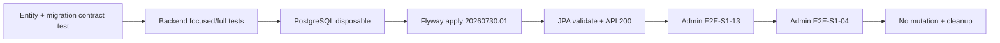

# Detailed Design — S2-DONE-FIX-02 DB Hash Length

## 1. Vấn đề

Backend S2 tạo snapshot hash theo canonical representation:

```text
sha256:<64 ký tự hexadecimal>
```

Tổng length là `71`, nhưng entity và PostgreSQL chỉ cho `64`. Vì lỗi nằm tại
persistence boundary, mock repository và unit test service vẫn pass trong khi
full-path E2E trả HTTP `500`.

## 2. Thiết kế sửa

### Backend/domain

- Giữ nguyên canonical hash và semantics snapshot binding.
- Entity `AdminReportAiResolution.targetSnapshotHash` đổi
  `@Column(length = 64)` thành `@Column(length = 71)`.
- Không thay đổi service, validator, DTO hoặc business rule.

### Database/Flyway

- Không sửa migration đã áp dụng `20260723.01`.
- Thêm migration tiến:
  `V20260730_01__admin_report_ai_snapshot_hash_length.sql`.
- Migration chỉ thực hiện:

```sql
ALTER TABLE admin_report_ai_resolutions
    ALTER COLUMN target_snapshot_hash TYPE VARCHAR(71);
```

Việc tăng `64 → 71` không làm mất dữ liệu cũ.

### n8n/provider

- Không thay đổi workflow hoặc prompting.
- n8n tiếp tục xử lý request canonical S2 và ký response.
- E2E dùng n8n thật để chứng minh provider outage/recovery và response boundary
  không bị ảnh hưởng bởi migration.

### Admin frontend

- Không thay đổi source UI.
- UI verify hai trạng thái:
  - operational error khi provider unavailable, có retry;
  - persisted manual recommendation khi critical evidence thiếu.

## 3. Luồng verify



## 4. Kết quả

- Physical schema và entity thống nhất length `71`.
- Canonical value được persist và trả lại đầy đủ.
- Provider failure không persist recommendation.
- Recovery persist đúng một recommendation.
- Thiếu critical evidence trả manual/no-action, không tự xử lý report/target.
- Không còn lỗi `value too long for type character varying(64)`.

## 5. Giới hạn

- Chưa áp migration lên external/production database.
- Gate không đánh giá S2-05 benchmark, numeric calibration hoặc deep evidence
  cho USER/CAFE_PAGE.
