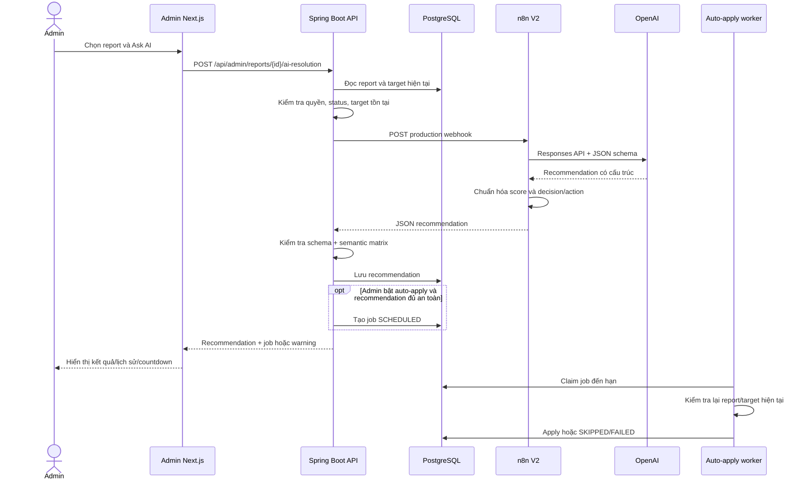
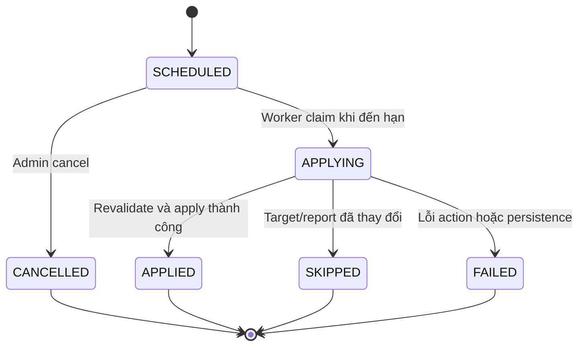

# Detailed Design — Resolve Report with AI cho Admin

> Phiên bản sau sửa lỗi: 2026-07-21  
> Nhánh kiểm chứng: `n8n/Ai-agent/fix-bug-report-admin`  
> Trạng thái kiểm chứng: **PARTIAL** — luồng BLOG, USER, CAFE_PAGE, bulk và auto-apply đã chạy thật; luồng COMMENT trên UI còn thiếu fixture an toàn.

## 1. Mục tiêu

Chức năng cho phép Admin yêu cầu AI phân tích một report, nhận khuyến nghị có cấu trúc, xem lịch sử và tùy chọn lên lịch tự động áp dụng hành động sau một khoảng trì hoãn. AI chỉ đưa khuyến nghị; report không được tự đóng ngay sau thao tác “Ask AI”.

Tài liệu mô tả thiết kế đã sửa theo đúng thứ tự xử lý:

1. Frontend Admin nhận thao tác và hiển thị trạng thái.
2. Backend xác thực, tạo context tin cậy, gọi n8n, kiểm tra kết quả và lưu dữ liệu.
3. n8n gọi OpenAI, chuẩn hóa response và trả về Backend.
4. Worker Backend xử lý job auto-apply khi đến hạn.

## 2. Phạm vi

### 2.1. Trong phạm vi

- Trang Admin `/reports`.
- Tạo recommendation đơn lẻ và theo lô.
- Lịch sử recommendation.
- Lên lịch, hiển thị countdown và hủy auto-apply.
- Target: `BLOG`, `COMMENT`, `USER`, `CAFE_PAGE`.
- Backend API dưới `/api/admin/reports`.
- Workflow n8n `cafestory-admin-report-ai-resolution-v2`.
- Kiểm tra hợp lệ của decision/action/score và kiểm tra target không bị thay đổi trước auto-apply.

### 2.2. Ngoài phạm vi

- Luồng AI moderation chạy lúc người dùng vừa tạo report.
- Ứng dụng mobile và web người dùng.
- Thay đổi cấu trúc database hoặc migration.
- AI vision đọc nội dung thực tế từ URL ảnh.
- Xác thực HMAC cho webhook n8n; đây là cải tiến bắt buộc cho production nhưng chưa nằm trong bản sửa hẹp này.

## 3. Kiến trúc tổng thể



## 4. Frontend Admin

### 4.1. Thành phần chính

| Trách nhiệm | File |
|---|---|
| Giao diện danh sách, detail, Ask AI, bulk và auto-apply | `5-cafe-story-nextjs-admin/src/components/admin/admin-reports-page.tsx` |
| API client và kiểu dữ liệu Admin | `5-cafe-story-nextjs-admin/src/lib/api/admin.ts` |
| E2E xuyên FE–BE–n8n | `5-cafe-story-nextjs-admin/tests/e2e/admin-report-ai.spec.ts` |

### 4.2. Điều kiện được Ask AI

Frontend chỉ cho tạo recommendation khi report có status:

- `OPEN`;
- `REVIEWING`.

Với `RESOLVED` hoặc `REJECTED`:

- nút Ask AI trong menu dòng bị disable;
- nút Ask AI trong detail bị disable;
- checkbox bulk bị disable;
- “Select page” chỉ chọn report đủ điều kiện;
- chế độ “All matching filters” vẫn lọc bỏ report terminal trước khi gọi API.

Backend vẫn kiểm tra lại cùng quy tắc để không phụ thuộc vào UI.

### 4.3. Ask AI cho một report

1. Admin mở detail hoặc menu dòng và chọn Ask AI.
2. Dialog cho phép bật/tắt auto-apply và chọn delay `15m`, `30m`, `1h`, `2h`, `6h`, `12h`.
3. Nếu bật auto-apply, Admin phải xác nhận rủi ro trước khi gửi.
4. FE gọi `POST /api/admin/reports/{reportId}/ai-resolution`.
5. Khi thành công, FE merge recommendation mới vào history và thêm job nếu Backend trả job.
6. Khi thất bại, lỗi xuất hiện ngay trong dialog với `role="alert"`; dialog không đóng để Admin có thể đọc lỗi và thử lại.

### 4.4. Bulk recommendation

Tên chức năng là **Generate AI recommendations**, không dùng “AI resolve all”, vì thao tác này không trực tiếp resolve report.

Hai chế độ:

- `All matching filters`: tải tất cả trang theo filter hiện tại, sau đó chỉ giữ `OPEN`/`REVIEWING`.
- `Selected reports`: chỉ xử lý report đủ điều kiện được chọn trên trang hiện tại.

Bulk chạy tuần tự với khoảng nghỉ ngắn giữa request. UI hiển thị:

- `Success`;
- `Scheduled`;
- `Skipped` do safety gate;
- `Failed`;
- `Remaining`;
- danh sách `reportId` và nguyên nhân của từng item lỗi.

Kết quả thành công một phần được giữ lại; một item lỗi không làm mất các recommendation đã tạo trước đó.

### 4.5. Auto-apply trên UI

Khi recommendation đủ điều kiện và Backend tạo job:

- UI hiển thị status job;
- job `SCHEDULED` có countdown;
- Admin có thể cancel trước thời điểm áp dụng;
- lịch sử job vẫn hiển thị `APPLIED`, `CANCELLED`, `FAILED`, `SKIPPED`.

Nếu recommendation không đủ điều kiện, Backend trả `autoApplyWarning`; UI hiển thị warning thay cho việc giả vờ đã tạo job.

### 4.6. Trạng thái lỗi và khả năng truy cập

- Lỗi request đơn lẻ nằm trong dialog đang thao tác.
- Lỗi bulk có vùng alert và chi tiết theo item.
- Nút nguy hiểm bị disable trong lúc request đang chạy.
- Report terminal có checkbox disable và kiểu hiển thị giảm độ nổi bật.
- Production build và typecheck là gate bắt buộc.

## 5. Backend Spring Boot

### 5.1. Thành phần chính

| Trách nhiệm | File |
|---|---|
| REST endpoints | `1-cafe-story-backend-javaspring/src/main/java/com/cafestory/controller/AdminContentReportController.java` |
| Tạo recommendation | `1-cafe-story-backend-javaspring/src/main/java/com/cafestory/service/serviceImplement/AdminReportAiResolutionServiceImpl.java` |
| Lên lịch và apply job | `1-cafe-story-backend-javaspring/src/main/java/com/cafestory/service/serviceImplement/AdminReportAiAutoApplyJobServiceImpl.java` |
| Worker polling | `1-cafe-story-backend-javaspring/src/main/java/com/cafestory/until/schedule/AdminReportAiAutoApplyJobWorker.java` |
| Cấu hình webhook/timeout | `1-cafe-story-backend-javaspring/src/main/resources/application.properties` |

### 5.2. API contract

| Method | Endpoint | Mục đích |
|---|---|---|
| `POST` | `/api/admin/reports/{reportId}/ai-resolution` | Tạo recommendation; có thể yêu cầu delayed auto-apply. |
| `GET` | `/api/admin/reports/{reportId}/ai-resolutions` | Lấy lịch sử recommendation. |
| `GET` | `/api/admin/reports/{reportId}/ai-auto-resolutions` | Lấy lịch sử job. |
| `POST` | `/api/admin/reports/{reportId}/ai-auto-resolutions/{jobId}/cancel` | Hủy job còn được phép hủy. |

Các endpoint nằm trong vùng bảo vệ Admin; client phải có role `ADMIN`.

### 5.3. Request tạo recommendation

Body tùy chọn:

```json
{
  "autoApplyEnabled": true,
  "autoApplyDelayMinutes": 15
}
```

Nếu không gửi body hoặc `autoApplyEnabled=false`, Backend chỉ tạo recommendation.

### 5.4. Context gửi sang n8n

Backend tự đọc report và target; không tin dữ liệu nội dung do browser tự gửi. Context gồm:

- `reportId`, `reportStatus`;
- `targetType`, `targetId`;
- mã/lãn report reason và severity;
- mô tả của reporter;
- nội dung/metadata target có liên quan;
- trạng thái target hiện tại.

Nếu report không tồn tại, target không tồn tại hoặc report đã terminal, request dừng trước webhook.

### 5.5. Response contract bắt buộc

```json
{
  "reportDecision": "RESOLVE",
  "targetAction": "HIDE",
  "confidenceScore": 92,
  "riskScore": 88,
  "labels": ["spam"],
  "ruleCode": "AI_HIGH_CONFIDENCE_VIOLATION",
  "explanation": "Giải thích không rỗng",
  "modelName": "gpt-4o-mini-2024-07-18"
}
```

Backend từ chối response khi:

- thiếu decision hoặc action;
- score null, NaN, vô hạn hoặc ngoài `0..100`;
- explanation/modelName rỗng;
- decision/action mâu thuẫn;
- action không hợp lệ với target type;
- body trống, JSON lỗi hoặc n8n trả non-2xx.

Backend không clamp score sai và không tự gán model name giả.

### 5.6. Ma trận decision/action

| Decision | BLOG/COMMENT | USER | CAFE_PAGE |
|---|---|---|---|
| `NEEDS_MANUAL_REVIEW` | `NONE` | `NONE` | `NONE` |
| `REJECT` | `APPROVE` | `KEEP_ACTIVE` | `KEEP_ACTIVE` |
| `RESOLVE` | `HIDE` hoặc `REMOVE` | `SUSPEND_USER` | `SUSPEND_PAGE` |

Mọi tổ hợp khác trả conflict/bad gateway tùy vị trí phát hiện và không được lưu.

### 5.7. Timeout và lỗi upstream

- URL mặc định dùng production path `/webhook/cafestory-admin-report-ai-resolution`, không dùng `/webhook-test`.
- Timeout Backend là `40000 ms`, lớn hơn timeout OpenAI node và phù hợp ngưỡng E2E.
- n8n non-2xx hoặc response lỗi được chuyển thành error contract rõ ràng; không lưu recommendation dở dang.

### 5.8. Safety gate khi lên lịch

Job chỉ được tạo khi toàn bộ policy hiện tại cho phép, ví dụ:

- decision/action thuộc nhóm có thể tự áp dụng;
- confidence đạt ngưỡng;
- risk đạt ngưỡng;
- delay hợp lệ;
- không có recommendation/manual-review không an toàn.

Không có job thì response phải có warning để UI giải thích.

### 5.9. Kiểm tra lại trước auto-apply

Khi job đến hạn, worker không áp dụng mù recommendation cũ. Service kiểm tra lại:

- job vẫn ở trạng thái có thể claim;
- report và recommendation vẫn tồn tại;
- `targetId` hiện tại khớp `targetId` trong recommendation;
- target vẫn ở trạng thái được phép tác động;
- với BLOG/COMMENT/CAFE_PAGE, `updatedAt` không mới hơn thời điểm recommendation;
- USER vẫn active trước khi suspend.

Nếu target đã thay đổi hoặc không còn phù hợp, job chuyển `SKIPPED` kèm lý do. Lỗi action/DB chuyển `FAILED`; chỉ action hợp lệ mới chuyển `APPLIED`.

Giới hạn hiện tại: USER chưa có version/`updatedAt` dùng được cho snapshot đầy đủ; safety hiện chỉ kiểm tra active state.

## 6. Workflow n8n

### 6.1. Định danh runtime

- Tên: `CafeStory Admin Report AI Resolution`.
- Workflow ID mới: `cafestory-admin-report-ai-resolution-v2`.
- Production webhook: `POST /webhook/cafestory-admin-report-ai-resolution`.
- Workflow cũ được giữ lại ở trạng thái inactive/archived để có thể đối chiếu; không xóa dữ liệu workflow.

### 6.2. Chuỗi node

1. **Webhook** nhận JSON context từ Backend.
2. **Build OpenAI Request** tạo prompt và JSON schema theo target type.
3. **OpenAI Responses API** gọi model được cấu hình.
4. **Normalize Response** parse kết quả, chuẩn hóa score, kiểm tra decision/action.
5. **Respond to Webhook** trả JSON thuần cho Backend.

n8n không được ghi trực tiếp vào database CafeStory và không tự mutate target.

### 6.3. Retry

Node HTTP OpenAI có:

- `retryOnFail=true`;
- `maxTries=3`;
- `waitBetweenTries=2000 ms`.

Retry chỉ giảm lỗi transient. Chưa có idempotency key nên cần bổ sung ở phiên bản production hardening.

### 6.4. Chuẩn hóa score

OpenAI có thể trả `0.85` hoặc `85`. Node normalize áp dụng:

- số trong `(0, 1]` được nhân `100`;
- số đã ở thang `0..100` được giữ;
- null, NaN, vô hạn hoặc ngoài phạm vi bị coi là invalid.

Ví dụ: `0.85` trở thành `85`, không lưu `0.85%`.

### 6.5. Semantic fallback

n8n kiểm tra ma trận decision/action. Nếu model trả tổ hợp không hợp lệ, workflow hạ về:

```json
{
  "reportDecision": "NEEDS_MANUAL_REVIEW",
  "targetAction": "NONE"
}
```

Backend vẫn kiểm tra lần hai. Đây là defense in depth, không phải lý do bỏ validation ở Backend.

### 6.6. Readiness

`/healthz` chỉ chứng minh process n8n đã lên, không chứng minh production webhook đã đăng ký. Readiness gate đúng phải:

1. chờ log activation hoặc gọi production webhook bằng payload contract hợp lệ;
2. retry ngắn khi gặp 404/5xx trong giai đoạn khởi động;
3. chỉ chạy E2E sau khi webhook trả 2xx.

## 7. Dữ liệu và trạng thái

### 7.1. Recommendation

Recommendation là audit record bất biến về kết quả AI tại một thời điểm. Các trường quan trọng:

- report/target identity;
- decision/action;
- confidence/risk;
- labels/ruleCode/explanation;
- modelName;
- rawResponse đã kiểm soát;
- createdAt.

### 7.2. Auto-apply job state machine



## 8. Kiểm chứng đã thực hiện

| Lớp | Phương pháp | Kết quả |
|---|---|---|
| Backend focused | 53 test cho controller + hai service | Pass, 0 fail/error. |
| Backend regression | `mvn test` | 607 test, 0 fail, 0 error, 1 skipped. |
| Coverage recommendation service | JaCoCo | 100% line, 86% branch. |
| Coverage auto-apply service | JaCoCo | 100% line, 88,97% branch. |
| Frontend | `npm run typecheck` | Pass. |
| Frontend production | `npm run build` | Pass. |
| UI static audit | Impeccable detector | `[]`. |
| n8n source | Parse JSON | Pass. |
| n8n runtime | Production webhook thật | HTTP 200; contract/score/model hợp lệ; khoảng 4,8 giây ở probe độc lập. |
| UI E2E | Chromium, Admin account | 28/30 scenario pass; 140/150 tiêu chí; cleanup pass. |

Hai scenario chưa kiểm chứng là seed COMMENT và Ask AI cho COMMENT vì môi trường không có comment của user khác an toàn để admin report. Backend COMMENT đã có unit test; UI runtime COMMENT vẫn cần fixture.

Evidence chính:

- `documents/report-admin/resolve-report-with-ai-fix/evidence/2026-07-21T22-32-19-492+07-00/`
- `documents/report-admin/ai-report-e2e/evidence/2026-07-21T16-10-47-782Z/`

## 9. Cấu hình vận hành

### Backend

- `ADMIN_REPORT_AI_WEBHOOK_URL` nên trỏ đến production webhook n8n.
- Timeout tương ứng `admin.report.ai.timeout-ms=40000`.
- Auto-apply cần cấu hình rõ enable, thresholds và worker interval theo môi trường.

### n8n

- Workflow V2 phải được publish/active.
- OpenAI credential/model phải được cấu hình trong container n8n; không ghi secret vào workflow/evidence.
- Health check deploy phải kiểm tra webhook registration, không chỉ `/healthz`.

### Frontend E2E

- Admin UI tại `http://localhost:3636`.
- Backend tại `http://localhost:8080`.
- n8n tại `http://localhost:5678`.
- Tài khoản test phải có role Admin.
- Cần ít nhất một target an toàn của từng loại, đặc biệt COMMENT không thuộc admin test.

## 10. Cải tiến đề xuất

### P0/P1 trước production

1. Thêm HMAC/shared secret, timestamp và replay protection cho webhook Backend → n8n.
2. Thêm idempotency key theo `reportId + requestId` để retry không tạo recommendation trùng.
3. Lưu snapshot hash/version của target trong recommendation/job; revalidate chính xác thay vì chỉ dựa `updatedAt`.
4. Tạo fixture E2E deterministic cho đủ bốn target type và cleanup riêng.
5. Thêm concurrency/locking test cho hai worker cùng claim một job.

### P2 về UX và vận hành

1. Cho phép retry riêng các item bulk thất bại, không phải chạy lại toàn bộ.
2. Thêm correlation ID xuyên FE → BE → n8n → OpenAI để điều tra lỗi.
3. Tách metrics: webhook latency, OpenAI latency, parse/validation failure, job skipped/failed.
4. Thêm circuit breaker/rate limit và giới hạn concurrency cho bulk.
5. Hiển thị lý do `SKIPPED` bằng thông điệp dễ hiểu cho Admin.
6. Nếu cần phân tích ảnh thật, tải/kiểm tra URL an toàn và dùng model vision; hiện ảnh chỉ là text URL.

## 11. Kết luận thiết kế

Sau bản sửa, chức năng đã chuyển từ trạng thái webhook production không hoạt động và validation lỏng sang một luồng có guard ở cả FE, BE và n8n; bulk không còn xử lý report terminal; auto-apply kiểm tra lại target trước khi tác động. Tuy nhiên, chưa nên xem là production-hardened cho đến khi webhook có xác thực, request có idempotency/snapshot version và E2E có fixture COMMENT ổn định.
