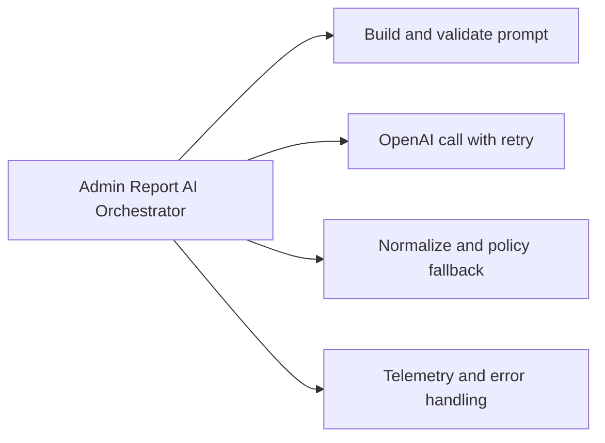

# Đề xuất cải tiến workflow Resolve Report with AI

## Nhận xét tổng quan

Workflow hiện đã chạy được và có safety tốt hơn, nhưng vẫn hơi “mong manh” ở ranh giới giữa các hệ thống: readiness n8n, retry OpenAI, tính duy nhất của request và tính mới của target. Hướng cải tiến nên là **giữ n8n làm orchestration**, còn quyền quyết định lưu/apply phải ở Backend.

## P1 — Cần làm trước production

### 1. Xác thực webhook Backend → n8n

- Ký HMAC trên timestamp + body hash.
- Từ chối timestamp quá cũ và nonce đã dùng.
- Không đưa secret vào workflow JSON hoặc evidence.
- Test đủ chữ ký đúng, sai, hết hạn và replay.

### 2. Idempotency xuyên hệ thống

- FE tạo `requestId` cho mỗi lần Admin xác nhận.
- BE lưu idempotency key theo report/request.
- BE truyền key sang n8n/OpenAI.
- Retry cùng key trả kết quả cũ hoặc cùng job, không tạo bản ghi trùng.

### 3. Snapshot/version target

- Recommendation lưu `targetVersion`, `targetUpdatedAt` hoặc canonical hash.
- Job copy snapshot đó.
- Worker so sánh trước apply; khác snapshot thì `SKIPPED`.
- Bổ sung version cho USER thay vì chỉ kiểm tra active state.

### 4. Fixture E2E deterministic

- Có test user riêng và dữ liệu BLOG/COMMENT/USER/CAFE_PAGE do test user sở hữu.
- Admin test chỉ tạo report lên target của test user.
- Cleanup theo marker/run ID.
- Không phụ thuộc dữ liệu ngẫu nhiên đang có trong Supabase.

### 5. Concurrency và job claim

- Test hai worker claim cùng một job.
- Dùng locking/compare-and-set rõ ràng.
- Retry apply phải idempotent.

## P2 — UX, quan sát và hiệu năng

### 6. Bulk queue thay vì vòng lặp trong browser

Hiện FE gọi tuần tự từng report. Với tập lớn nên tạo bulk command ở BE:

- FE gửi filter hoặc danh sách ID một lần.
- BE tạo batch và xử lý có giới hạn concurrency.
- FE poll/SSE progress.
- Có cancel batch và retry riêng item lỗi.

### 7. Correlation ID và metrics

- Một correlation ID xuyên FE, BE, n8n, OpenAI và job.
- Dashboard: request count, validation failure, webhook latency, OpenAI latency, retry count, skipped/failed job.
- Alert khi webhook 404, tỷ lệ fallback manual-review tăng hoặc latency vượt SLO.

### 8. Readiness chuẩn

- Deploy gate gọi production webhook bằng probe contract hoặc endpoint registration chuyên biệt.
- `/healthz` chỉ là liveness.
- Chờ activation log/workflow registered trước E2E.

### 9. Circuit breaker/rate limit

- Giới hạn số request bulk đồng thời.
- Backoff theo `429/5xx`.
- Circuit breaker khi OpenAI/n8n lỗi liên tục.
- UI hiển thị trạng thái “tạm ngưng AI” thay vì lỗi chung chung.

### 10. AI vision nếu thật sự cần

Nếu moderation cần hiểu ảnh:

- chỉ fetch URL allowlisted và có timeout/size/content-type limit;
- chống SSRF;
- gửi image input thực sự cho model vision;
- lưu audit rằng ảnh nào đã được phân tích.

## Topology n8n đề xuất

Không gộp mọi logic thành một workflow lớn. Nên dùng:

Orchestrator chịu trách nhiệm request/response. Child workflow tách prompt, provider call và telemetry để dễ test, version và thay model. Backend vẫn là nơi cuối cùng validate/persist/apply.

## Thứ tự triển khai khuyến nghị

1. COMMENT fixture + E2E đủ 30/30.
2. HMAC/replay protection.
3. Idempotency.
4. Snapshot version/hash và concurrency test.
5. Correlation ID/metrics/readiness.
6. Bulk backend queue.
7. Vision nếu có yêu cầu nghiệp vụ rõ ràng.
